## Psychonauts 2 {time: 2026-04-24T00:00:00.000Z}
Psychonauts 2 is a 3d platformer about entering peoples' minds and helping them deal with their demons, but in a fun, children's cartoon sort of way. 

https://store.steampowered.com/app/607080/Psychonauts_2/

---
The game is full of fun ideas of how to map a person's inner world and mental problems into surreal explorable environments, all of it realized without any obvious cut corners. The levels also meaningfully contribute to storytelling, since the levels are literally characters. I liked the story overall, it has a good arc and pace, save for the occasional mandatory lore dump. The combat is present and it's okay, and the game has assist options that lets you turn off the difficulty if you don't care about it.

If you are looking for a light story in an interesting setting, do check this one out.

## Judofuri {time: 2026-04-24T18:00:00.000Z}
Judofuri is a party game for up to 9 players that contains a bunch of minigames, all of which involve using only a single button.

https://store.steampowered.com/app/3013460/Judofuri/

---
The presentation is fun, the controls are simple enough and minigames are explained well enough that non-gamers can easily join in (I found it easier and less frustrating than Mario Party, at least), and you can play with everyone on the same keyboard for extra chaos. My group liked it a lot, so consider it for your own get-togethers if it makes sense. Also, if you like it, please leave a Steam review for it, this game deserves more eyeballs.

## RB: Axolotl {time: 2026-04-25T18:00:00.000Z}
RB: Axolotl, a visual novel about cute axolotls in a tank doing cute somersaults. It's also about overcoming obsessions, living with a chronic disease, accepting death with dignity, and coming to terms with existential horrors. 

https://store.steampowered.com/app/1014580/RB_Axolotl/

---
It's nowhere near perfect, the writing is sometimes overlong (chapter 3 out of 5 in particular feels interminable and should be cut in half), but the characterization is solid, the plot is good enough, and the author has things to say. If you are looking to read something weird (i.e. unusual in premise and progression) that sometimes goes pretty heavy, this is worth looking at.

## Shadows over Loathing {time: 2026-04-26T20:30:00.000Z}
Shadows over Loathing is a text-heavy turn-based RPG about solving mysteries in a Lovecraftian setting, that is actually just a vehicle for the writers to deliver lots and lots of jokes. 

https://store.steampowered.com/app/1939160/Shadows_Over_Loathing/

---
And these are good jokes, as the writers clearly care a lot about playing with language. There are puns, visual gags, grammatical jokes, obscure dictionary humor, like 3 kinds of ye olde Englische, observational humor, all delivered in easily digestible chunks. It's the only game I know that has both an arachnophobia and arachnophilia settings in the options menu. It also plays with Lovecraftian tropes in a fun way, featuring all the usual cliches, as well as (extensive) time paradoxes and teeth nightmares.

One more thing I like with it, is that the game doesn't waste your time: there are no pointless transitions or unskippable animations (unless it's the joke), the simple animation style means that there are no loading screens, and you can increase or skip the animations in the options menu. The game lets you read it as fast as you want to. I recommend this game if you are looking for a funny Lovecraft or something with a light tone in general, just be prepared to do a lot of reading.

## Taiji {time: 2026-04-27T18:00:00.000Z}
I played Taiji, a game about exploring a mysterious island and solving puzzles about coloring square grids with 2 colors. 

https://store.steampowered.com/app/1141580/Taiji/

---
It is heavily inspired by The Witness, in that it takes a core puzzle mechanic, wordlessly adds to it, explores it to its full potential, and also has big in-world meta puzzles. If you liked that game and want something that feels similar (but without philosophizing), it's well worth trying. Taiji is also better than The Witness in that I finished it.

## Superliminal {time: 2026-04-28T18:00:00.000Z}
https://store.steampowered.com/app/1049410/Superliminal/

I played Superliminal. It starts as a Portal-inspired puzzle game whose core mechanic is making small objects far (and changing their size this way), but then it shifts into playing with various perspective tricks and mechanics, and generally keeping the player in a constant sense of mild surprise.

I found the puzzles straightforward and the conclusion hackneyed, but it was fun during the 2 hours it took me to finish it. It's well worth experiencing if you get it with a discount.

## Mango {time: 2026-04-29T20:20:00.000Z}
Mango starts with a musician returning to their designer apartment, eating a spoiled mango and going on a bad fever trip.

https://store.steampowered.com/app/1458690/Mango

---
It then goes on through their memories and increasingly broken and surreal environments and they slowly lose grip on reality. Mechanically this is a walking simulator with some lock and key puzzles, which are sometimes a bit obtuse (I managed to miss obviously placed keys like 3 times). I also thought that the game's author likes interior design, I found the game's spaces interesting to consider as a construction.

You should get this game if you like surrealism and exploration, I don't think that it has much going for it otherwise.

## Supraland Six Inches Under {time: 2026-04-30T18:00:00.000Z}
I finished Supraland Six Inches Under. Here you play as a meeple in a sandbox diorama, trying to escape the Rakening (i.e. a child rebuilding the diorama), when you fall underground and look for a way out. 

https://store.steampowered.com/app/1522870/Supraland_Six_Inches_Under/

---
Mechanically it's a metroidvania from a first person perspective. I like the unusual verbs the game gives you (e.g. one early unlock is a beam gun that lets you connect two wooden surfaces, walk on the beam and pull the surfaces together), together with somewhat messy level design. There are few sterile puzzle rooms here, you usually have a big area with a bunch of puzzles all mashed together and figuring out what does what and when is fun. This messiness also provides fun exploration, since there are a lot of nooks and crannies to discover, often with something hidden inside. There is writing, but it's too light to care about. The game has combat, but there isn't much of it - you'll be exploring and solving puzzles the majority of the time. The difficulty options also go from "full invincibility" to "receive double damage", so you can trivialize it if you don't like it. Some puzzles require more exploration and leaps of deduction than games typically ask for, so you may also get stuck in places.

It took me about 9 hours to get to the credits and about 20 to finish it 100%. The cleanup drags, so consider stopping after the credits song. If you like exploring interesting spaces and rats maps, this is worth your attention.

## Lightmatter {time: 2026-05-01T18:00:00.000Z}
I played Lightmatter this weekend. It's a first person puzzle game heavily inspired by Portal, whose main mechanic is avoiding shadows and using light sources to make a safe path forward. 

https://store.steampowered.com/app/994140/Lightmatter/

---
I liked this game a lot: the puzzles are clever but not too difficult, and the voice on the intercom is well acted and characterized. The voice's furious meltdown in the back end of the story is a highlight. I didn't like the somewhat drab visual style, and it also has a few too many references to Portal, but otherwise I found it fun. This game took me 3 hours to finish and I would recommend it.

## Citizen Sleeper {time: 2026-05-02T18:00:00.000Z}
I played Citizen Sleeper and it is very good, just as everyone is saying.

https://store.steampowered.com/app/1578650/Citizen_Sleeper/

---
Its prose is evocative of the places you go to and how they feel on the senses (which fits, since you play an emulated human mind in a mechanical body that supports only limited senses, meaning that you are constantly deprived), and there is a lot of emotional caring and vulnerability between you and the characters around you. My main complaint is that the game systems fail to convey the desperation of survival of a new refugee in an unfamiliar place, I was never particularly pressed for time or resources. Once you switch from surviving to living, it turns into a very good sci-fi visual novel with extra steps. The only time I felt any pressure from the game was in the first part of the post-launch story update, but even then the game expects you to be fully established before starting it, so it's mostly about staying focused. I heard that the sequel has a difficulty selection and more involved stress mechanics, so maybe that will address my disconnect.

In short, it's very good, highly recommended if you like evocative sci-fi or want to indulge in a fantasy of belonging. I have the final third of the post-launch update story to go, and it looks like I will have finished the game in 12-13 hours in total.

## 1000xRESIST {time: 2026-05-03T18:00:00.000Z}
I finished 1000xRESIST. It's a walking simulator/visual novel type of game, where the aliens come to earth, bring a deadly disease with them, and there is one normal girl in the world that has an immunity to it.

https://store.steampowered.com/app/1675830/1000xRESIST/

---
You play as the Watcher, a clone of the said girl who lives in a society of other clones, and whose job is to delve into the memories of the original and learn things. The Watcher learns too much, the things go off-script, cue a story about the reasons and mechanics of generational trauma.

I didn't find the game overwhelmingly good like many other online opinions claim. The graphics are distractingly cheap and it took me some time to adjust, the first third of the story didn't have a hook, most voices were directed as half-sleeping haze for some reason. Things get better once the brakes are off in the second half, but I didn't particularly enjoy the first half. I can also tell that the narrative is very well constructed, with all of its callbacks and allegories making sense, but it didn't hook me emotionally either.

It's still a well-made story that the developers have a lot to say in, but I don't find it to be the best narrative in video games ever, as some reviews online like to claim. Would still recommend.

## Betterified VI: Bestified {time: 2026-05-04T18:00:00.000Z}
Betterified VI: Bestified is a fan Mario game. 

https://www.youtube.com/watch?v=uWw2SSdcHWs

In spirit it's an elaborate, high effort shitpost from a rowdy Discord community, with individual levels ranging from funny and stupid, to surprising and genuinely creepy, with lots and lots of secrets and hidden mechanics.

For example, in one of the levels you go to the Eat Fog island, where you have to eat fog. One of the worlds is just the UK, Ireland and northern France. All of the Bowsers have immigrated to Ireland, so its one level contains nothing but Bowsers. Having a religion is a game mechanic. And so it goes on, each level something new and surprising, well worth messing around with.

Note that in terms of difficulty this is harder than mainline Mario games, and parts of it can get frustrating. If you just want to tourist around for a bit, look for a list of cheat codes for SMBX2 (the game's engine). You can trivialize the challenge as far as you want, the game doesn't care.

## Quadrilateral Cowboy {time: 2026-05-05T18:00:00.000Z}
Quadrilateral Cowboy is a game about doing cool heists in the far future of 1980. 

https://store.steampowered.com/app/240440/Quadrilateral_Cowboy/

---
Which is to say that it has cyberpunkish cybernetic implants, space elevators and flying motorcycles, but also all the technology has the aesthetics, tactility and interface design of the computers from 1980. The gameplay consists of you manipulating your environments by entering terminal commands into your laptop so that you can get at a thing in a secure location. Every level introduces a new tool or idea, so the game never gets repetitive. Unfortunately, the game also feels like one long tutorial: you get to use all of the tools at your disposal only in the final level, and then the game ends. Brandon Chung's games always had very condensed storytelling and this one also has lots of his trademark smash cuts, but the brevity applied to game systems makes them feel underutilized. Steam Workshop has a few extra levels, but I played the Itch version, so I couldn't access those. The game's ~4 hours long, and it's well worth playing if you get it on a discount.

## Dread Delusion {time: 2026-05-06T18:00:00.000Z}
I finished Dread Delusion, an indie first person RPG in the style of Elder Scrolls. You are a prisoner in a floating island world, and you were conditionally released as an agent of the local apostatic inquisition.

https://store.steampowered.com/app/1574240/Dread_Delusion/

---
You then travel the islands, discovering the local weirdness and solving problems. I didn't like the opening section much, but it gets better once you are released into the world and can encounter things at your own pace.

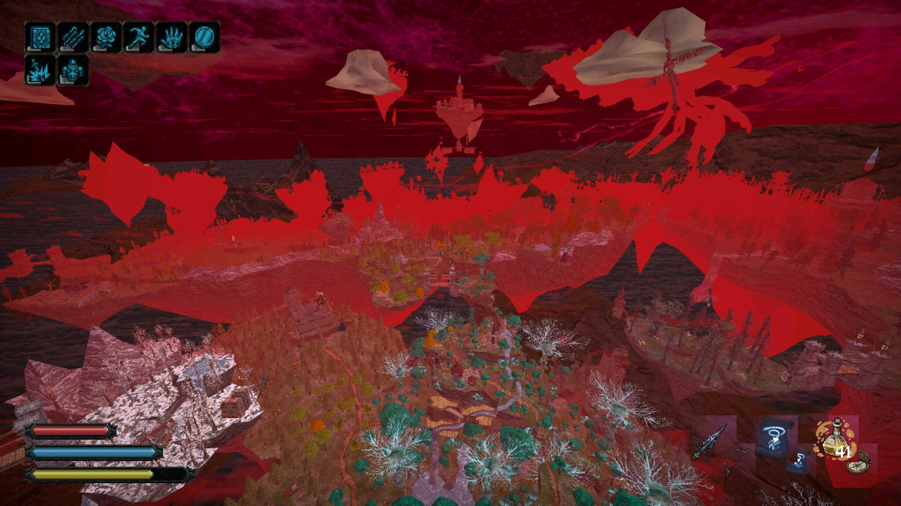

The game's setting is increasingly weird (i.e. unconventional fantasy). My personal highlight was one of the later islands that is basically tzarist Russia run by an increasingly corrupted (in the computer sense) reality-altering AI, I didn't expect having to consider how to handle AI alignment. I also like how the game de-emphasizes combat, you get stronger only by completing quests and finding floating skulls in exploration, and you can run or sneak past most if not all enemies. The combat itself is about as basic as Skyrim and gets pretty repetitive. The music is noticeably short and loopy, but I found it unobtrusive enough. The writing is fine, it's not particularly good or bad, other than some millennial lines in the player's dialogue.

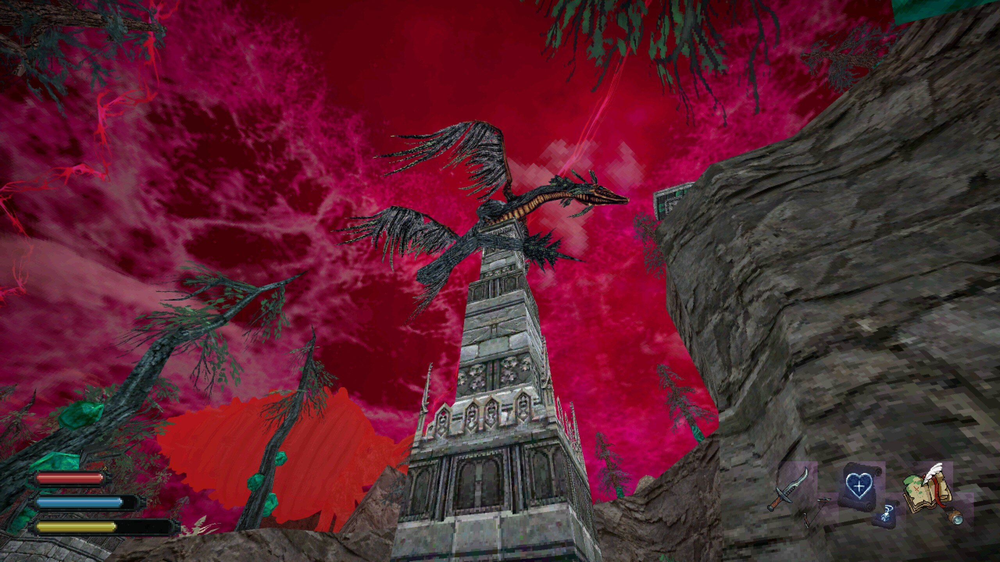

Overall I enjoyed the game and would recommend it to people who like exploration in the Elder Scrolls games. I suggest going for a pacifist playthrough to make things less tedious.

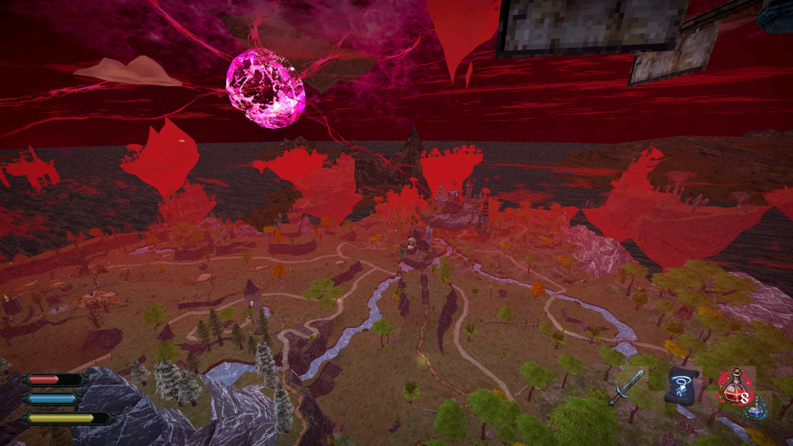

## ENA: Dream BBQ {time: 2026-05-07T18:00:00.000Z}

ENA: Dream BBQ is an interactive entry in a short webseries on Youtube about a cubist girl(?) going places in a surrealist vaporwave world, heavily inspired by early 3d virtual chat applications and experimental PS1 games.

https://store.steampowered.com/app/2134320/ENA_Dream_BBQ/

---
Mechanically it's a first person exploration game. It's not quite a walking simulator, there's some light platforming and other verbs if you care to dig into it.

This game is surrealism done right, I liked it a lot. Every explorable area is colorful and visually striking, the characters are a lively combination of badly rendered PS1 models and handmade 2d animations by Hieronymous Bosch, everyone speaks their own language without any language barriers (the only other game that does this is Tekken, I think), the plot progression is a series of places connected like in a dream, and I found the audio presentation unexpectedly good. It also has lots of secrets and hidden things to find, giving you an excuse to play through it multiple times.

This game is free and you can finish a run in 1-2 hours. It's only the first chapter, the others are going to be paid. If you like visual arts and enjoy surreal vibes, this game is very worth your time.

## Zeno Clash 2 {time: 2026-05-08T18:00:00.000Z}

I played Zeno Clash 2. The game's immediate standout feature is its visual art style, which I can best describe as a video game adaptation of a cool graphic novel by Hieronymous Bosch, set in a postapocalyptic stone age.

https://store.steampowered.com/app/215690/Zeno_Clash_2/

---
I know that I used Bosch as a comparison with ENA, but the chimeras and strange landscapes in this one are even more faithful to his works, and the graphic novel part comes from the logic of character and environment construction. Mechanically it's a brawler in the style of Streets of Rage from the first person perspective.

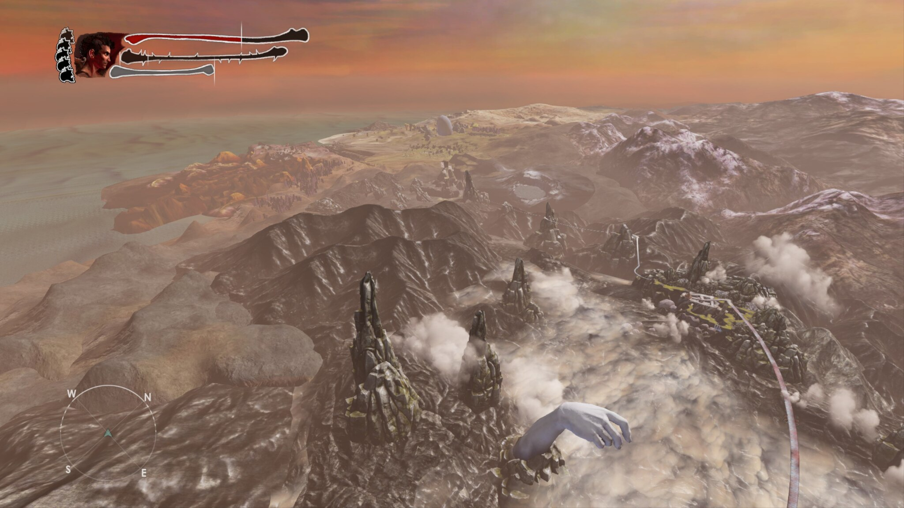

It has some fun exploration in between fights, and the combat system itself feels good. You can get through the game with the same combo, but it's only 6-8 hours long and doesn't overstay the welcome. The music is suitably strange, though I found the voice mixing a bit quiet. The narrative is enough to give an excuse to move forward, but otherwise it doesn't get in the way. I had fun with it, would recommend for visuals alone.

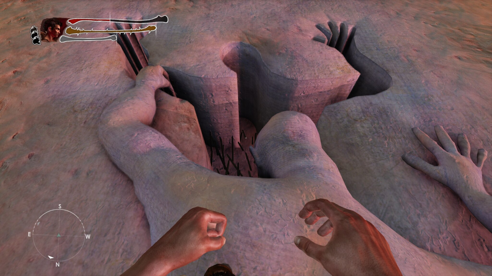

## Spirited Thief {time: 2026-05-09T18:00:00.000Z}
I've been playing Spirited Thief lately.

https://store.steampowered.com/app/1709870/Spirited_Thief/

---
Mechanically it's an X-COM style turn-based tactics game, applied to stealth gameplay: like in X-COM you can take 2 actions to move your units before all the enemies take their turns, but instead of failing to hit aliens with 90% hit probability, you are sneaking behind the guards' backs to loot everything that isn't nailed down. Before starting a heist you first scout the level using a friendly spirit that can pass through walls and observe everything, which lets you build a plan in advance. You can also see where the guards are going to move on the next turn, but only if you can directly see them or have them tagged with the said spirit, which makes sure that you have to do some degree of improvisation. It's a smart design that reinforces the theme very well, I like it a lot.

A pithy description would be Invisible Inc. without procedural generation, or alternatively, turn-based Shadow Tactics. I also like the story: it's nothing exceptional, but it's competently put together and it has likable characters. If you like squad tactics or stealth games, this is a strong recommendation.

## Rain World {time: 2026-05-10T18:00:00.000Z}
I finished Rain World recently. It's the developer's ecosystem simulation turned into a full 2D platformer game, with the prettiest pixel art dilapidated architecture you'll have seen recently.

https://store.steampowered.com/app/312520/Rain_World/

---
The game's unique selling point is that it fully commits to being an ecosystem simulation: in this game you are not a protagonist making their way through a set of levels, instead you are just a squishy Slugcat. There are lizards that will attack anything that moves, or fight between themselves, or just lazily lie there and ignore you. There are scavengers that go out in squads to hunt wildlife and can be bribed to let you pass. The spiders live underground and are skittery as fuck when illuminated, but they will gang up on anything in the dark, and sometimes they combine into a larger mass to mimic a different predator that lives in the tunnels. There are carnivorous plants that mimic a climbable pole, there are living tendrils that look for carryable objects that they then steal and hoard. Everything is driven by a procedural animation system that makes all the movements seem uncannily smooth and organic, it's very impressive.

You are a slugcat, you're preyed on by 80% of the fauna and flora, and your only hope is to outsmart or befriend the opposition. The environments are large, expansive and were not built to accommodate or guide you, the rain is apocalyptic and you can only survive in a shelter between the cycles, and sometimes the game is just outright unfair (like when you cross a screen transition and a camouflaged lizard immediately chomps you). This game requires patience, the right mindset, it's hard and requires some undivided blocks of time, but it's possible to learn how to overcome the odds and survive. The game itself does have lore and an ending to strive for, but it's vague post-apocalyptic worldbuilding vibes rather than any lore dumps (unless they expanded it for DLC).

That said, it's not respectful of your time in the same way nature doesn't care about fairness. I can see why this game developed a cult following, but I don't think many people in this group would enjoy it. So instead I'll post some safari videos in the inline thread. If you still want to try it yourself, make sure to enable the Remix mod so that you can tune the difficulty somewhat, and play as the Monk for your first go.

## Sunderfolk {time: 2026-05-11T18:00:00.000Z}

Another game I can recommend it Sunderfolk. I tried it this weekend with my friend group and it went down really well.

https://store.steampowered.com/app/2414270/Sunderfolk/

---
It's a dungeon crawl turn-based RPG where one player runs the game on a screen, and then each player controls their character using their own smartphone app, Jackbox games style. Mechanically it feels like a more casual Gloomhaven with a good tutorial and easy to track game systems to get everyone accommodated (on the normal difficulty anyway). Each character gets about 4 action cards they can do on their turn, and once they pick a card, they take the actions in the exact order provided. What the characters try to achieve depends on the exact scenario they are in (it's usually killing all the baddies), and you will need to do some planning to get things done.

There's also a bunch of systems outside of the combat engine in the city you are rebuilding, which are introduced one bit at a time. The presentation is pleasant, with easy to like characters. The story is generic high fantasy you won't feel guilty skipping, which is fine as an excuse for a get-together. It's a very accommodating game and it can work very well for groups that want a shared RPG experience, but who don't have lots of gaming experience or don't want to commit to something heavy (like a full TTRPG or Gloomhaven).

## Gato Roboto {time: 2026-05-12T18:00:00.000Z}

Gato Roboto is a nice and short metroidvania with a 1 bit palette visual style, where you are exploring an abandoned security station as a cat in a robot suit. 
https://store.steampowered.com/app/916730/Gato_Roboto/

---
I really liked how well the game flows: the movement feels smooth and has satisfying stomping sounds, the enemies are lively and provide good feedback, the difficulty is just right, there is no filler, you get powerups constantly and there's little mandatory backtracking. Put together I found it a very satisfying game to finish in a single 2.5 hour session. I would recommend this to anyone looking for something punchy and bite sized.

## Formless Star {time: 2026-05-13T18:00:00.000Z}

Formless Star is a free creature collection game where you explore a randomly generated continent and try to find as many different kinds of animals as you can. 

https://splendidland.itch.io/formless-star

---
It's one of those games where all the colors are pastel and nothing bad happens. I recommend this if you're looking for something cute and sedate, and you can fully explore it in about 1 hour.

## Mysteries Under Lake Ophelia {time: 2026-05-14T18:00:00.000Z}

Mysteries Under Lake Ophelia is a fishing game around a vaguely threatening lake in the middle of the woods. 

https://bryce-bucher.itch.io/mysteries-under-lake-ophelia

---
There's not a lot to it mechanically, but it has a strong, eerie atmosphere, nice fishies, and you can reach the ending credits in about 2 hours. Phrased differently, it's a narrower scoped Dredge from the depths of the PS1 library. Would recommend it for the spooky vibes.

## Sulphur Nimbus: Hel's Elixir {time: 2026-05-15T18:00:00.000Z}

Sulphur Nimbus: Hel's Elixir is a My Little Pony collect-a-thon platformer where you play as a hippogriff. 

https://oddwarg.itch.io/sulphur-nimbus-hels-elixir

---
What makes this game interesting is that the creator decided to take the movement of a winged horse 100% seriously and tried to make it as physics-accurate as he could. Imagine what a flying horse would be like inside the Microsoft Flight Simulator, if its developers decided to add it to the game with the same level of care as all of their planes. You have to constantly manage your momentum and be aware of flight physics and your own stamina to get anything done, which is sometimes frustrating, but it's also unlike any other platformer I played.

In the game proper you are exploring a castle, its infrastructure and the surrounding island, trying to clear away the curse that surrounds the land. The exploration is somewhat open worldish, with some combat. I found the setup similar to Pseudoregalia, except without ability unlocks. The game is mostly fine, with one ice level that has extra bad ice physics, and the ending sequence which is an unexpected high point. If you are allergic fanfiction-level writing, note that there's barely any writing present: you spend 95% of the game either on your own, or with a characters who speak a language you don't understand (Norwegian?).

Overall, I wasn't expecting to get a simulationist take on MLP when I downloaded this, but I had fun. I would be interested in a higher-budget second take at this idea. Would recommend this if you are looking for a platformer that does something new.

## Disco Elysium {time: 2026-05-16T18:00:00.000Z}
This weekend I finished Disco Elysium. It's a story about a detective who went on a 3 day drinking binge so hard, that he forgot literally everything.

https://store.steampowered.com/app/632470/Disco_Elysium__The_Final_Cut/

---
The game starts when you wake up and then struggle to piece yourself together and solve a murder that you're supposed be working on. I won't spoil any of the narrative past the premise, because discovery is a big part of the game and I don't want to take it away.

Mechanically the game is about 15% adventure game style exploration and item collection, and 85% RPG dialog with skill checks. The skills in this instance are the different parts of the protagonist's psyche: Encyclopedia is your factual memory, Empathy is your ability to relate to other people, Half-light is your fight or flight response (who usually expresses itself as anger) and so on. The more points you put into a skill, the easier the corresponding checks become, but having a skill too high makes it contribute negatively to your well-being (my highest skill was Logic, and one point I lost some morale because Logic thought that the task I was given was too basic for my advanced intellect). It's an original framing of RPG skills that lets you build a detective archetype like no other game. There is no combat.

![A screenshot fro Disco Elysium, with one of the protagonists internal dialogue visible on the right: "YOU Failure? RHETORIC - Yes! Abject failure. Total, irreversible defeat on all fronts! Absolutely vanquished, beaten, curb-stomped and pissed on -- until *you* came along! *You* will reverse the fortune of the workers of the world. You alone, against every living thing, against every human alive: eight hundred trillion reál in the hands of an *impossibly* well organized ruling class; towering city blocks of bank-men who have the ears of prime ministers; million-headed armies of nations and the love of your own mother! You -- against the atom, the charm and the spin. Where the whole world failed --matter failed to bend to human will; human will failed to get out of bed and tie its laces -- you alone, single-handedly, will rebuild the dreams of the working class. You are The Last Communist."](screenshots/disco-elysium.png)

Another thing worth pointing out is the tone. This game has constant Yakuza-style tonal whiplashes, except the proportion between fun and serious are switched around. The default atmosphere is fairly bleak: you are a failure of human, stranded in an extra poor part of a declining city, trying to solve a grisly crime while constantly being disrespected by the locals. But then you can decide that you're a hustle culture finance bro, are asked to get a degree in advanced racism from the CEO of Racism, and then die from trying to sit in the world's most uncomfortable chair. The bleakness is constantly interrupted by some absurdly funny nonsense, especially if you fail skill checks (especially the Authority ones), and it greatly helps maintain your attention. You should never quickload a failed skill check, the failures are entertaining here. Or you could metagame the system and just try to win at the game by solving the case properly, like I did. The game noticed this and then mocked for being boring.

In short, this is a very strong narrative, and I would recommend it to anyone who's looking for a worthwhile RPG without combat, or a good, touching story in general. Disco Elysium is good literature with an excellent soundtrack and you will get to feel things. My completionist playthrough where I listened to all the voice acting took me about 40 hours.

## Weird West {time: 2026-05-17T18:00:00.000Z}
I tried Weird West. It's a Diablo-like that aspires to be an immersive sim set in the supernatural wild west (think Hunt: Showdown, or RDR: Undead Nightmare).

https://store.steampowered.com/app/1097350/Weird_West_Definitive_Edition/

---
The game just didn't grab me. It's played from the top down perspective like a Diablo, but there aren't that many different enemy or weapon types and it eventually becomes repetitive. There is stealth, which is just the familiar line of sight mechanics over mostly flat terrain with boxes scattered everywhere. There are different substances and elements and their interactions, but there aren't many chances to exploit them mid-combat, and I didn't see a use for them outside it. It also has a bunch of imsim-adjacent mechanics (social standing, property ownership, ability to move every single object etc.) but it provides no reason to use any of them. Minute-to-minute you are doing either combat or stealth, or grind resources to get the next unlock. The game does have 5 different protagonists whose stories you play through and you start with a bounty hunter, some maybe it gets more interesting with more the esoteric picks, but I didn't want to continue even when the game handed me a pigman.

The game's southern/wild west gothic setting is excellent, but I would try something else if this sounds appealing to you (South of Midnight, maybe?).

## NaissanceE {time: 2026-05-18T18:00:00.000Z}
I played NaissanceE, a first person megastructure exploration game. 

https://store.steampowered.com/app/265690/NaissanceE/

---
Its main selling point is the structure itself, and although it seemed to pick greyboxes as the visual style, it's never visually boring. The game does a very good job of varying the scale, shapes, repeating elements and illumination of its infinite grey walls, and it never becomes monotonous. 

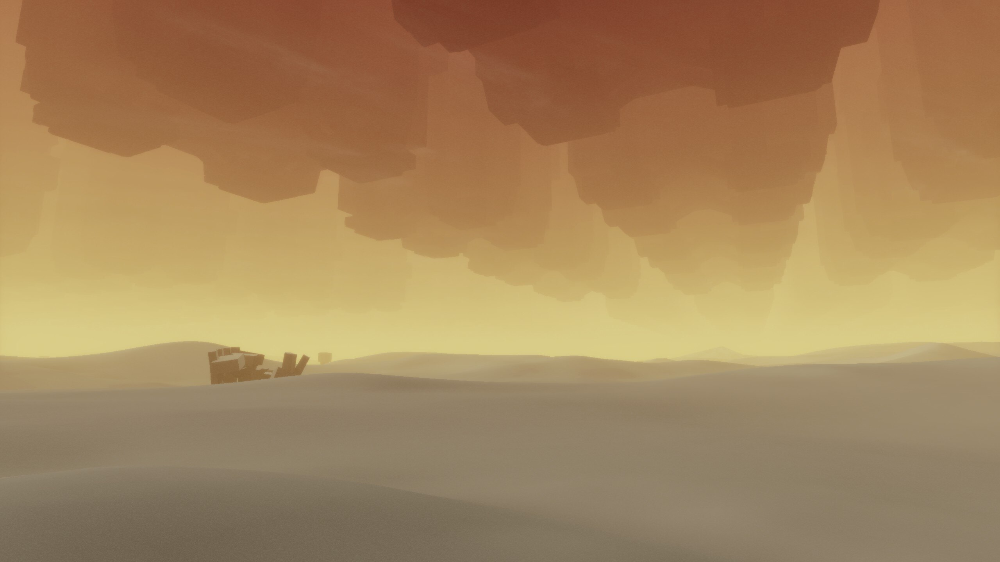

At its best moments the game feels like you are exploring the out of bounds areas of some unfinished project, even if it takes you some time to find the way forward. The rest of the game is uneven: progression is sometimes frustrating because of first-person platforming, the narrative is absent (though it does try for something abstract), and there really is little to hook you other than the megastructure.

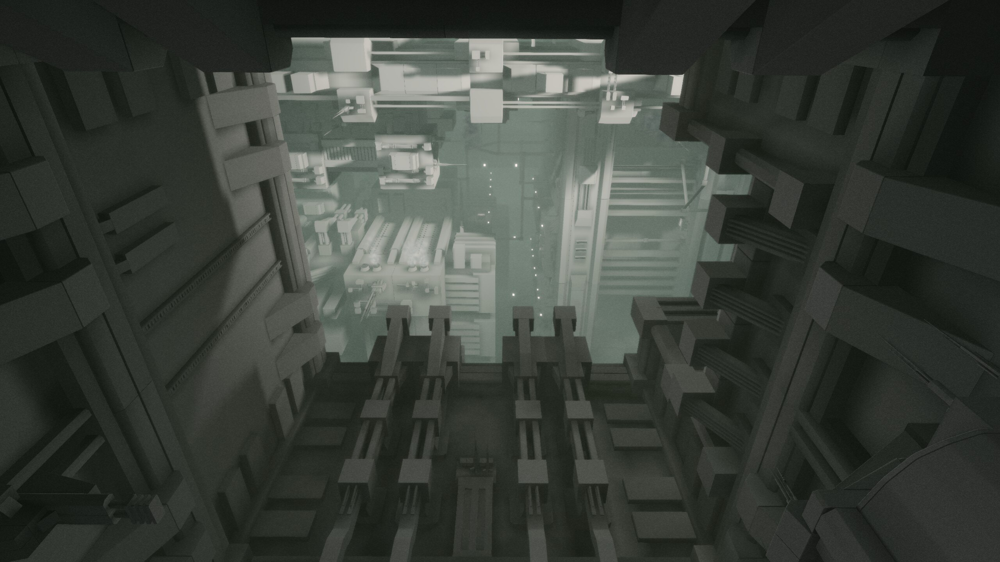
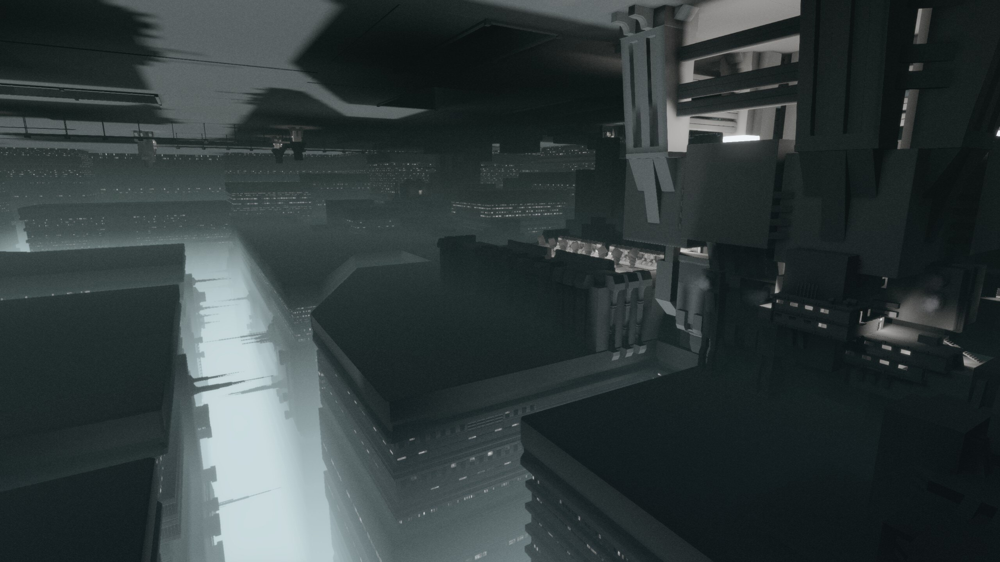

I mostly found it just okay. Would recommend this if you already played Manifold Garden or ECHO, and you want to explore megastructures some more.

## Hoa {time: 2026-05-19T18:00:00.000Z}
Hoa is a heavily Ghibli-inspired 2d puzzle platformer about a forest sprite returning to its place of origin to help a friend. 

https://store.steampowered.com/app/1484900/Hoa/

---
You explore a bunch of excellently hand drawn natural locations with gentle piano and woodwind music setting the scene, talk to the local googly-eyed fauna and collect butterflies to progress. The mechanical basics are solid, the movement is precise and feels good to interact with. Platforming difficulty level is low, but not trivial: there isn't anything punishing or too demanding, but you can lose a bit of progress from a fall. It's child friendly too.

I would recommend this game if spending 2 hours immersed in Ghibli's interpretation of nature as a tiny creature sounds appealing.

## Another Crab's Treasure {time: 2026-05-20T18:00:00.000Z}
Another Crab's Treasure is a game about a hermit crab who had his shell taken away by an opportunistic tax collector following the recent annexation of his tide pool, so he is forced to pursue his house in the big city and learn about crabitalism.

https://store.steampowered.com/app/1887840/Another_Crabs_Treasure/

---
Mechanically it's a proper soulsborne game with all the mechanics, game feel and design cliches you would expect (poison swamp, anyone?), but it's set in a colorful and imaginative crab society that runs on the trash economy. I found seeing mundane items recontextualized as tools, weapons and fashion, as well as high-concept Dark Souls fantasy tropes presented as ocean pollution to be fun.

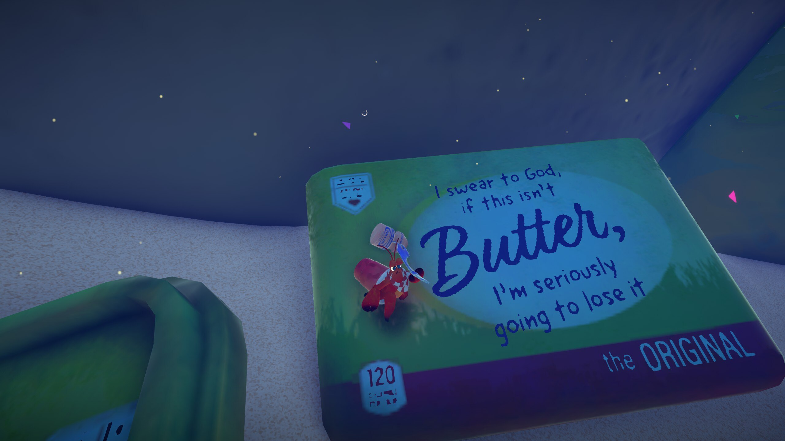

This is a great game to get into the genre: although the game's default difficulty is appropriately high, it's also opt-out. You can reduce the difficulty in the options menu with all the expected settings (parry difficulty, your and enemies' health, resource loss etc), and it can also give you a gun. Just a normal, human-size firearm for a tiny crab that kills everything in 1 hit. If you ever run into a difficulty spike, the game gives you the option of just shooting it in the face and never judges you for it.

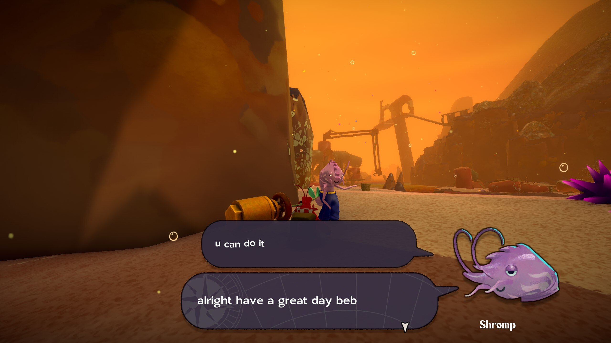
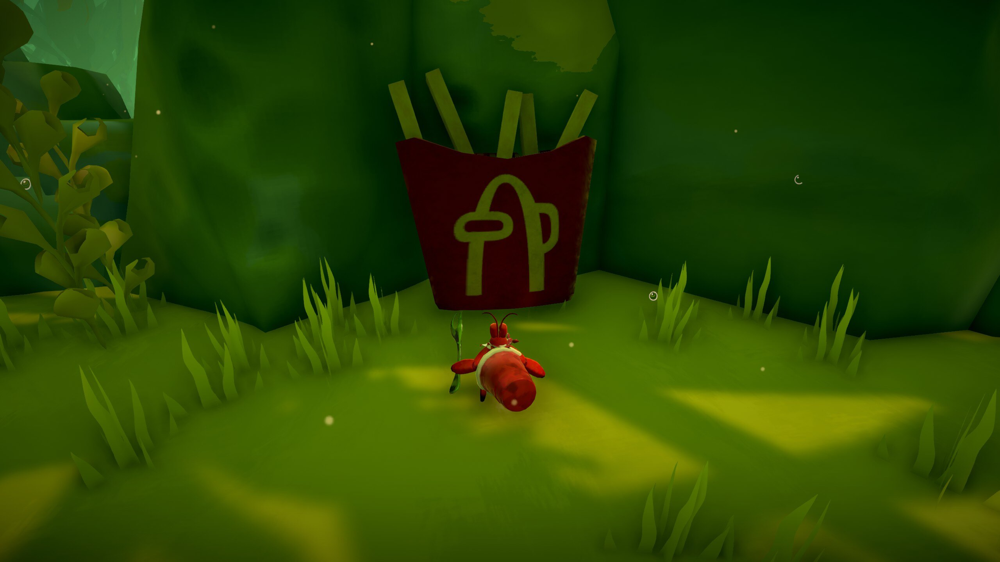

This game took me 20 hours to finish and I would recommend it if you want to try to get into soulsborne games, or if you like exploring underwater.

## DOGWALK {time: 2026-05-21T18:00:00.000Z}
DOGWALK is a free ~15 minute game about building a snowman and walking a dog.
https://store.steampowered.com/app/3775050/DOGWALK/

## The Dark Queen of Mortholme {time: 2026-05-22T18:00:00.000Z}
The Dark Queen of Mortholme is a game where you are the final boss of a soulslike, facing off against the hero who keeps coming back. It's free, it can be finished in a single sitting of 15-20 minutes, and it presents some worthwhile ideas. Would recommend playing it blind.

https://qwertyprophecy.itch.io/mortholme

## CrossCode {time: 2026-05-23T18:00:00.000Z}
I've been playing CrossCode recently and I like this game a lot. It's an RPG with actiony combat, a lot of puzzles and a very nice 16-bit SNES RPG visual style (Legend of Mana specifically).

https://store.steampowered.com/app/368340/CrossCode/

---
The game is set inside an in-universe MMO, where you are a player who gets smuggled into it for reasons that become clear later. The narrative is 80% MMO questing and raids in a casual guild, except the game is balanced around being fun, rather than maximizing player retention like actual MMOs. There is some grinding involved (it comes with the premise), but the time required is on the order of minutes, rather than hours. Another detail worth mentioning is that the player character can barely speak, and the logical consequences of their muteness is a major plot point, used both for comedy and drama. The characters in general are very endearing and I found the character portraits in particular to be unusually evocative.

Mechanically the game is built around quickly and accurately throwing charged projectiles at distant targets, often around corners. This is the main puzzle mechanic that gets supplemented with other elements, and you often have to hit things from behind in combat too. Combat is mandatory only inside dungeons, in the overworld you can run past enemies without them bothering you, and puzzles are everywhere. It also helps that puzzles are demanding, it makes them feel like a core part of the game that they are, rather than mere padding. Exploration is also treated as a puzzle, getting to hidden chests is not obvious and sometimes involves finding a way to elevate yourself several screens away and lots of jumping. The game has an assist mode with difficulty sliders to make it more accessible too.

Like I said, I like this game a lot, and I would recommend it if you are looking for a SNES-era action RPG that doesn't patronize you. It took me 55 hours for a 100% playthrough of the base game, and I'm also finishing up the DLC at about 15 hours.

## Deliver At All Costs {time: 2026-05-24T18:00:00.000Z}
Deliver At All Costs is a top down driving game about being a courier in a kooky 1960s USA. Mechanically it wants to be a game about carrying out absurd orders in a world that works on cartoon logic, something like Crazy Taxi with more complications.

https://store.steampowered.com/app/1880610/Deliver_At_All_Costs/

---
Unfortunately this game is let down by its main story. There is too much of it, as it constantly forces you to uneventfully commute to your workplace and back home. It is also very tonally and thematically confused: it touches on overcoming toxic workplace relationships, childhood trauma, the nature of justice under the rule of law, there are secret government agencies, a revenge plot, time traveling to save the future from a dystopia (??)... It doesn't cohere into anything and in practice it ends up just padding the runtime.

Despite that, the actual deliveries are pretty fun. Each mission has a different gimmick, and they all run on Scooby Doo logic. This includes things like delivering a live, car sized marlin to be painted, who needs to fed by driving into barrels of fish on the way, or delivering a trampoline to a military base, which the soldiers mistake for a target and open artillery fire on. I feel like the developers underexplored what could be done here, especially given how underutilized destruction, car gadgets and the later areas of the game are. They ran out of time, maybe?

This is a mixed recommendation from me, as there are things worth experiencing in between the nonsense. I hope the developers get a chance to improve with a sequel, as the skeleton for something good is there. I 100%-ed it in about 12 hours, and I would expect the main story playthrough to be 6-8 hours, so get it with a discount if you want to try it.

## Monster Hunter World {time: 2026-05-25T18:00:00.000Z}
I played Monster Hunter World, a third person action game where anime Flintstones hunt a wide variety of dragons, dinosaurs and other oversized lizards. 

https://store.steampowered.com/app/582010/Monster_Hunter_World/

---
The loop is straightforward: you set off on a hunt for a particular target, you search for its footprints or other leftovers, you find the target creature and try to defeat it (either slaying it or capturing it). The fights typically last over 20 minutes, as you slowly whittle down the monster's health, it tries to run away, or gets into a turf fight with the other local megafauna, or it itself gets hunted by the game's actual apex predator, or you run out of inventory or your weapon loses sharpness and you retreat to recover. If you succeed, you get the creature's parts, which you then use to craft equipment to hunt scarier creatures.

A huge part of the game is combat. There are 14 different weapon types, each of which has a meaningfully unique concept or play style, and they have enough complexity to them that it takes 15-20 hours to get fully used to each one. Personally I used a switch axe, an axe that unfolds into a sword. Using it as an axe provides you with excellent horizontal sweeps and a big damage overhead combo finisher, and it also builds charge. Using it as a sword provides you with longer reach and slower movement, and it also converts axe charges into the amp meter, which then triggers additional effects on strike when full. I also played with a long sword for a bit, and its moveset is a combo tree that compares to something from Devil May Cry or Bayonetta, to give you an idea of the depth involved.

On top of all that you have to be mindful of the fact that you can't change your facing direction in the middle of the combo, using your wrist-mounted projectile launcher/grapple hook effectively, remembering to sharpen your weapons when needed, using the gadgets of your cat companion, being aware of elemental damage and status ailments, being aware of the different monster tells and so on and so forth. Basically, the mechanical overhead is higher than usual for a game of this type, but to game's credit it doesn't demand quick reflexes. I never had to parry anything, though this depends on your weapon choice I would imagine. Other things I like are Palicoes (the very marketing-friendly cat companions with lots of animation appeal), the horn-heavy orchestral soundtrack, and the unusually involved food preparation cutscenes.

If this interests you, be aware that the game doesn't have a pause function. When you start a hunt, the game expects 50 minutes of uninterrupted attention from you, which would be problematic for parents in particular. If you are a compulsive collector, it may be a good idea to avoid this game too, because after you finish all the optional side hunts, building all armor sets is the end game. I found the difficulty of the base game fairly manageable, and I was able to get through by just keeping a single set of equipment fully upgraded, so there wasn't much grinding. I'm told that all the properly sweaty hunts that require having an actual build live in the expansion, but I didn't play that yet.

In short, I liked this, would recommend.

## Critters For Sale {time: 2026-05-26T18:00:00.000Z}
Critters For Sale is a visual novel/point and click adventure hybrid containing 5 short stories about the timeless competition beyond human understanding, as seen from the perspective of various bystanders(?) across time. 

https://store.steampowered.com/app/1078420/Critters_for_Sale/

---
The game's most striking feature is its surreal 1 bit dithered visual style paired with a somewhat unsettling soundtrack that I find very cool. The stories themselves are more about the big picture lore points than individual characters, so it's more about delivering vibes than the plot. There's also far too much UI friction when you try to replay a segment to get other endings (fast forward isn't fast enough, and there are too many second-long pauses between scene transitions) which really starts to chafe if you are trying to get everything. Overall it's more style than substance, but what a great style it is. I recommend this game if you are looking for something unusual to dip into for a bit.

## Strange Jigsaws {time: 2026-05-27T18:00:00.000Z}
Strange Jigsaws is a puzzle game about solving strange jigsaws. The title really is that descriptive, the game presents and reinterprets the concept of a jigsaw in as many unique, surprising and delightful ways as it can. 

https://store.steampowered.com/app/2702170/Strange_Jigsaws/

---
Saying more about it would be spoilers, and I think that it's worth everyone's time to experience it blind. You can finish it in 3-4 hours, there is no filler.

## Maneater {time: 2026-05-28T18:00:00.000Z}
Maneater is a very good 7/10 game about being the son of the shark from Jaws who has Had Enough. After a 10 minute introduction, you spend the next 10-ish hours eating fish, humans, sharks and whales, growing in mass, spontaneously evolving electricity powers and being a public menace, just as Spielberg intended. 

https://store.steampowered.com/app/629820/Maneater/

---
This game does only one thing, being a bloodthirsty shark, and it lets you play out that fantasy with as few interruptions as it can manage. Other than the brief tutorial at the start and short Discovery channel documentary style story cutscenes, it's all just gameplay and flow and constant progression into new environments in the US's east coast. It often looks very nice too, which helps. It's a fun, brainless game to unwind to over a weekend, possibly with a podcast. I would recommend it, but only if you can tolerate the shark slander.

## Nauticrawl {time: 2026-05-29T18:00:00.000Z}
Nauticrawl is a game about escaping a planet in a submarine/airship, whose operation you are not trained in.

https://store.steampowered.com/app/922100/Nauticrawl/

---
You are presented with the internals of the machine, and have to use the mouse to interact with the different panels and controls to figure out how they work, and then use them to progress. It's also turn based, meaning that for the most part the game doesn't expect you to react to threats quickly, which significantly reduces the stress level of the task. It feels like a spiritual predecessor to the Iron Lung, except the horror of the deep is replaced with the impostor syndrome.

Structurally Nauticrawl is a roguelike, and I accidentally managed to mainline my fourth run straight to the ending. It didn't take me that long to master the controls, and I wouldn't have stuck with it much further anyway. Would recommend it with a discount if the game's premise sounds interesting to you.

## Infini {time: 2026-05-30T18:00:00.000Z}
Here's a find: Infini. So, mechanically this is a puzzle game whose main mechanic is screen wrapping. As you change which part of a level is shown on the screen, you can move yourself from one edge of the screen to the opposite side, allowing you to circumvent obstacles.

https://store.steampowered.com/app/1120420/Infini/

---
This idea is thoroughly explored and iterated on throughout the game, so it never gets repetitive. However, this is the kind of puzzle game where you need to execute sometimes janky-feeling solutions in real time, so it could get a bit frustrating in places.

But then there's the rest of it. The game's visual style is best described as enthusiastic programmer art, a crude mixture of hand drawn character designs and animations mixed with heavily photoshopped backgrounds. Despite this it also feels intentional, with the systems and visual effects being more polished than you would expect from the screenshots. The story is a very symbolic experimental high concept, involving abstract ideas fighting and interacting across the different layers of reality, as the protagonist, Hope, is slowly ground down into surrender.  The music is also unusual and heavily contributes to the atmosphere, with the developer being listed as one of the two musicians who produced it.

This entire project feels like passionate outsider art and I won't pretend like I understood the message it's trying to convey, but it's exactly the kind of open-ended thing that would have inspired multiple hour-long video essays if anyone had heard of it. I feel like it's abrasive enough that it's not for everyone, but I would recommend it if you are looking for something artistically challenging to experience.

## Tales From The Off-Peak City Vol. 1 {time: 2026-05-31T18:00:00.000Z}
Tales From The Off-Peak City Vol. 1 is a game about becoming a pizza chef in order to steal the owner's legendary saxophone and help overthrow the local megacorp from destroying the neighborhood.

https://store.steampowered.com/app/1129920/Tales_From_OffPeak_City_Vol_1/

---
You can immediately tell that this game was made by an artist: you can find few parallel lines in the environments, every single interior feels as though it has unique assets and architecture tailored specifically for its strange inhabitants, there are loads of unique diegetic music tracks, most conversations involve some kind of arts etc. It's a very GAC-y game, even if mechanically it's essentially just exploring a 3d space and doing fetch quests. This is a strong recommendation for people who like to take screenshots or like modern art/architecture/design.

## Welcome to the Dark Place {time: 2026-06-01T18:00:00.000Z}
Welcome to the Dark Place is horror interactive fiction about escaping the titular Dark Place.

https://store.steampowered.com/app/1135700/Welcome_To_The_Dark_Place/

---
I didn't explore it a lot because it turned out to be much larger than I expected, but the one location I thoroughly explored left a very positive impression.

Mechanically this is a Twine-like piece of interactive fiction, except with sound and an occasional crunchy visual. I like how the game requires you to do things of questionable sense one bad decision at a time, always providing you with an option to linger or back out, until that suddenly disappears too. You don't know if there's a jumpscare coming, and you can't guess where it could be if it takes you 20 individual steps to descend into the dark basement. The sounds are used to a great effect, with sudden cuts to silence or positional noise unnerving you further. It did build some terror in me, so it must be doing something right.

This game is free, so if you are looking for something darker and more literary for Halloween, I would recommend this with a pair of headphones.

## Islets {time: 2026-06-02T18:00:00.000Z}
Islets is a pretty chill 2d platformer metroidvania about exploring and joining together sky islands that progresses more or less as you would expect. Its tone, presentation and difficulty are fairly relaxed, and I enjoyed how it feels to control.

https://store.steampowered.com/app/1669420/Islets/

---
The movement is a bit awkward at first, since your character has a bit of a momentum, but after some acclimation and a few movement upgrades it starts to flow really well. It's not perfect, I found the levels to be a bit boxy and sparse visuals-wise, and too many monsters have the design of a weird potato with googly eyes stuck to it, but I found it easy to overlook these nitpicks. If you want something Silksong-shaped but can't be bothered with its difficulty, consider this game instead. It took me about 7 hours to 100% it, so it won't overstay its welcome either.

## Blobun {time: 2026-06-03T18:00:00.000Z}
Blobun is a short and very snackable puzzle game about trying to cover every tile in a level with wibbly goo without stepping into it yourself.

https://store.steampowered.com/app/3284270/Blobun/

---
It's not very difficult overall (though it does support custom levels), but it keeps things interesting by constantly introducing and developing new puzzle mechanics, and the optional puzzles can be satisfyingly tricky. I found it a relaxing 3-4 hour playthrough, and I would recommend it if you like this sort of game. Also, the developer wants you to know that slime you play as is a lesbian, but that's neither here nor there.

## Betrayal at Club Low {time: 2026-06-04T18:00:00.000Z}
Betrayal at Club Low is a short (~2 hour) RPG about infiltrating a night club while disguised as a pizza delivery man.

https://store.steampowered.com/app/1885750/Betrayal_At_Club_Low/

---
The game's main mechanic is rolling dice to succeed at any significant interaction: you and your opponent have the main skill die (e.g. deception vs attentiveness), as well as any modifiers from temporary conditions (e.g. feeling sneaky, gullibility), equipment and effects achieved through other means. Advancing consists of you upgrading the values on the sides of your individual skill dice and assembling custom dice from the sides that you collected/pickpocketed. It's an interesting system, more reminiscent of a tabletop game where each turn involves rolling and rerolling some 10 dice at once, though I don't like how it has snowballing both in the positive and the negative directions built-in, which encourages save scumming. The world layout allows for a variety of builds and approaches, but I suggest not ignoring deception if you do pick this up, since pickpocketing can give you unique resources you can't gain otherwise.

This game is by Cosmo D, and it very much has the developer's visual style: interesting and varied surface textures, bold colors and interesting objects everywhere, concern and practice of the arts is on the mind of many of the characters, building faces, good music, the ongoing mystery plot, Pizza. Unlike his other projects, this game has point and click controls and game-controlled camera, which, together with how dice rolls are conceptualized, evokes Disco Elysium. You don't need to have played any of the other Cosmo D's game to enjoy this, and I would recommend it if you are looking for a short, replayable and weird-looking RPG.

## Last Call BBS {time: 2026-06-05T18:00:00.000Z}
I've been playing Last Call BBS. It's supposed to be the last game from Zachtronics, the team that made all those engineering puzzle games, because its founder and main creative decided to teach math to children instead (he since returned to making engineering puzzlers under a different name).

https://store.steampowered.com/app/1511780/Last_Call_BBS/

---
In it, you are someone from the present who uses a fictional home computer from 1980s (think MSX or Amiga) in order to connect to a BBS and pirate some applications. In practice it's a collection of 8 games with a very fancy wrapping. They're as follows:

- 2 Zachtronics style engineering puzzles: 20th Century Food Court (about building conveyor production lines and programming them like a modular synthesizer) and ChipWizard Professional (just straight up silicon chip design out of PNP and NPN transistors and the wires that connect them).
- 2 less conventional puzzle games: Dungeons & Diagrams (a combination of nurikabe and picross) and X’BPGH: The Forbidden Path (a game about setting up a cellular automaton to grow a particular configuration of cells, but presented as the puzzle version of Scorn, its excellent).
- 2 solitaire games that first appeared in other Zachtronics games: A surprisingly solvable variant of 3-draw Klondike (from Shenzhen I/O) and a take on Freecell that involves sorting the cards into stacks of the same card (from Eliza).
- virtual not-Gundam figurine painting application. Excellent game to listen to podcasts to, and I also learned something about the appeal of painting figurines.
- block matching arcade game that reminds me of Tetris Attack.

It's a great set of games if you like Zachtronics puzzles, would recommend. My favorites were The Forbidden Path for its excellent theming, and 20th Century Food Court for another interesting programming challenge that's not too difficult to get through.

## Video rec {time: 2026-06-06T18:00:00.000Z}
On art and video games: Here's a Youtube essay about how the Metal Gear Solid 3 evokes cinema history when played with a monochrome filter. 

https://www.youtube.com/watch?v=dzBhf6zElYU

It goes into what makes colorless images and fixed camera angles compelling to the viewer, and what different interpretations the game evokes when played this way. The channel's creator himself started as a video game reviewer, before falling into the hole of art history and media literacy.

## Soup Rooms {time: 2026-06-07T18:00:00.000Z}
Soup Rooms is a free collection of virtual art rooms made by various indie developers with different ideas, messages and aesthetics. 

https://kiteline.itch.io/soup-rooms

---
The game itself consists of you walking around small enclosed spaces with something in the middle, and then moving somewhere else when you had your fill. A virtual museum walking simulator, if you will. I found some of the exhibits memorable (the laments of extinction in particular), and I think that you would find something worthwhile there too.

## Arco {time: 2026-06-08T18:00:00.000Z}
Arco is an unusually atmospheric (soulful, even) squad tactics game with lightly branching story about traversing magical Mesoamerica to get revenge. 

https://store.steampowered.com/app/2366970/Arco/

---
Its main unique selling point is the simultaneous turn combat: in each encounter you enter your characters' actions, and they carry them out at the same time as the enemies in one second increments. The combat outcomes are decided by smart positioning and timing of abilities, and calculations mainly involve known small numbers rather than dice rolls. In practice it feels like it branched off Firaxis' XCOM and Into the Breach. The game also switches out your skill trees every few hours, which means that you get to figure out how to use a new interesting tool set as soon as the old one is solved.

Most screens in the game present pretty, well-composed landscapes that always occupy two thirds of the scene, which go really nicely with the game's rich acoustic guitar soundtrack (it reminds me of Nuclear Throne in places) and the ambient sounds. It creates a real vibe that you can emotionally engage with. The prose is short and to the point: it does its job, you won't remember it, but it also doesn't get in the way. I really liked that no part of the game wastes your time with meaningless filler: text appears a full sentence at a time with no animations introducing it (letting you read it as quickly as you want to), the UI feels very responsive and immediate for the same reason, and there are no random encounters with every combat scenario being a handmade puzzle. The game respects your time when you play it, and doesn't beg you for engagement when you're done.

I liked Arco, and I would recommend it to fans of squad tactics games or people looking for lightweight RPGs. One of the assist modes even lets you skip combat if you only want to experience the vibes. My one caveat is that it can feel a bit mentally draining, so long sessions aren't a given. It took me about 15 hours to roll credits.

## Robocop: Rogue City {time: 2026-06-09T18:00:00.000Z}
In Robocop: Rogue City you play as Robocop between movies 2 and 3, and the game cares both about presenting fan service and further developing the themes of the series. 

https://store.steampowered.com/app/1681430/RoboCop_Rogue_City/

---
You get to visit the iconic locations from the series and shoot creeps in their hundreds, yes, but you also build rapport with your colleagues and community, do routine police work, get psychotherapy sessions and figure out your humanity. Mechanically it's an FPS where you are a walking tank without any fancy movement abilities as is the current fashion in boomer shooters, and with all the expected Robocopisms, but it's also about helping the people and getting them to accept Robocop.

What I like about this game is that it's a very smartly scoped AA project that doesn't have any of the fat you would usually expect from a cinematic video game these days. The environments are smallish with not a lot of different characters, but they are very detailed, believably lived in and without any filler (think Yakuza games as a model). There are no pointless collectibles or fetch quests, all side content ties into the themes of the story or serves to develop the characters. There isn't the budget for much exposition or pointless diversions, so the writing present is there to advance the plot. No time or effort was wasted in the making of this game.

I would recommend this to any fans of Robocop, or for people who want an uncomplicated shooter where you are Mr. X from Resident Evil 2. It's about 15 hours to finish, and it's a very good purchase for the current price of 4 euros.

## DROD {time: 2026-06-10T18:00:00.000Z}
DROD is the best puzzle game ever made.

https://store.steampowered.com/app/314330/DROD_Gunthro_and_the_Epic_Blunder/

---
It presents itself like a top-down dungeon crawler, where you control a character with a sword next to it. Every turn involves you either moving to adjacent cell, or rotating your sword by 45 degrees. Once you move, every monster in the room then deterministically moves in response. Your objective then is to kill every monster in a room and leave.

What makes this game interesting is the huge number of different puzzle elements and their interactions. Take wraithwings as an example: they are giant bat-like creatures that attack you in a straight line if they are in a group, but as individuals prefer to stay 5 cells away from you. Already you have to be aware of their changing behavior if there are several wraithwings in a room and try to keep them all on the same side or behind walls. You need to have a plan of how to catch the final stragglers. Wraithwings are flying creatures, so they will move over bottomless pits (where you can't follow) and won't trigger pressure plates. You can position them to create a safe space within larger groups of monsters, or to prevent a roach queen from spawning a new roach, or create a dead end to trap serpents and so on. The puzzle rooms the developers put together require you to manipulate them just so, and it leads to some of the highest density of eureka moments in all puzzlers. It takes up your full attention, I can't listen to a podcast playing this for example.

If you enjoy a cerebral challenge and are looking for a serious thinky game, I highly recommend this series. The best starting point is Gunthro and the Epic Blunder, an official level set that was designed to be approachable by new players. It's the fourth game in the series, but it's the easiest one and narratively it's a prequel. You can get the other 3 games as DLC (plus the fifth game that is sold separately).
