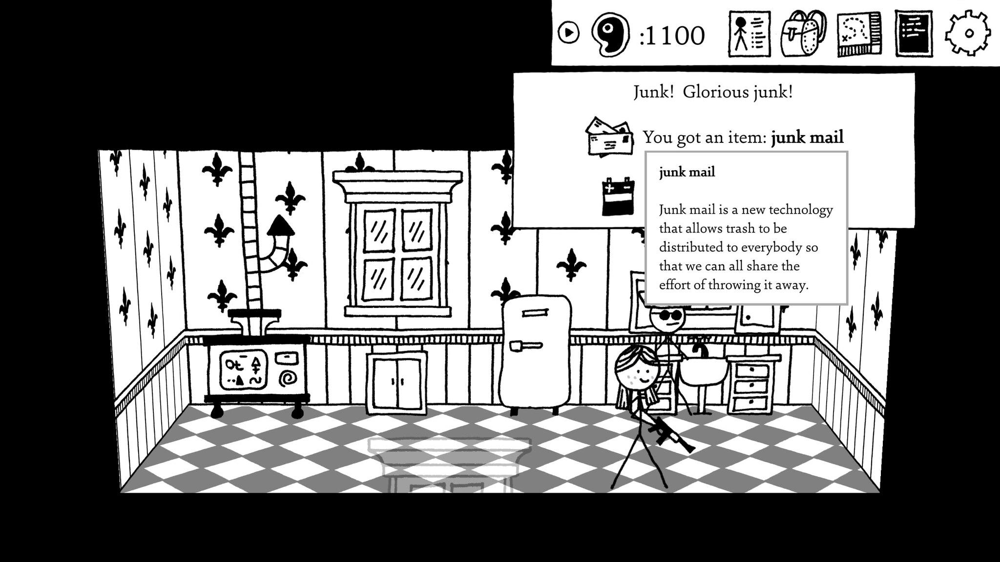
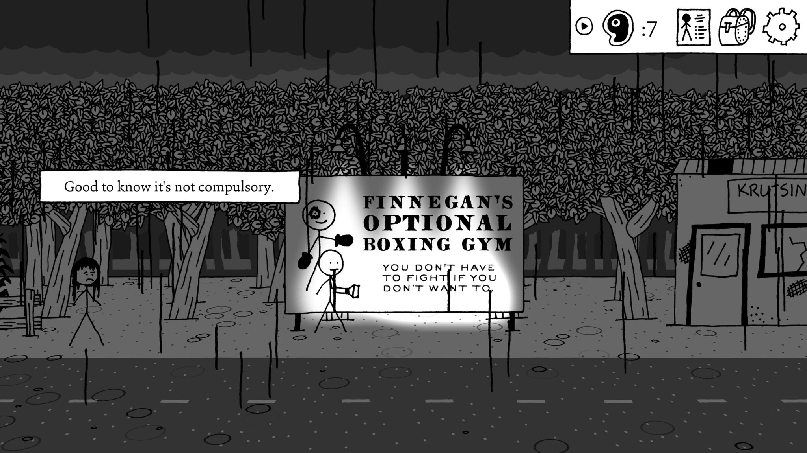
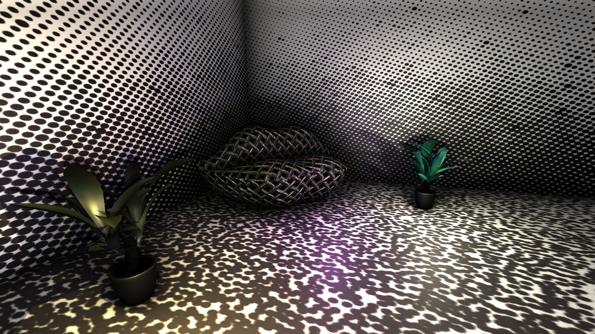
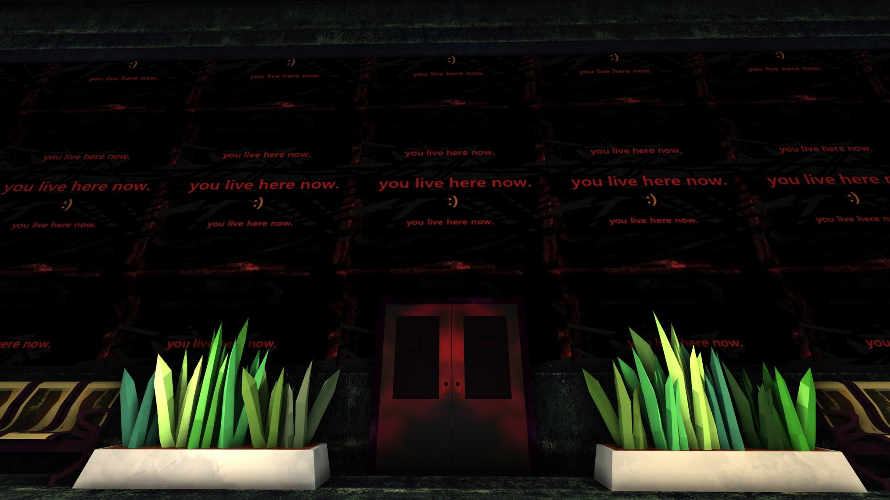
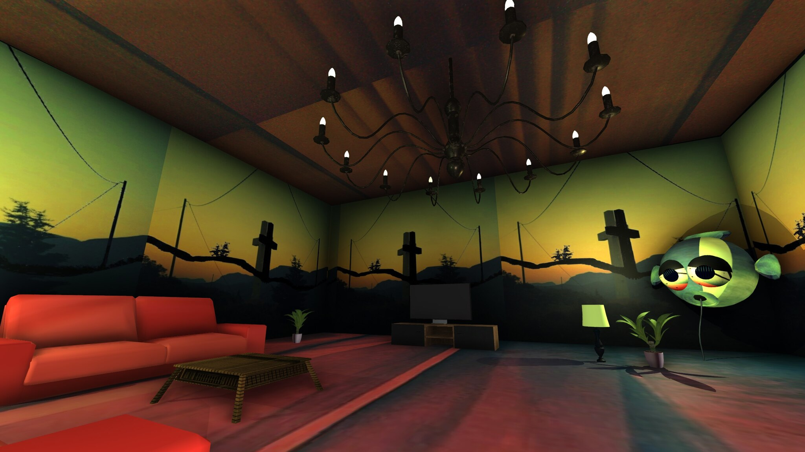

## Psychonauts 2 {time: 2026-04-24T00:00:00.000Z}
Psychonauts 2 is a 3d platformer about entering peoples' minds and helping them deal with their demons, but in a fun, children's cartoon sort of way. 

https://store.steampowered.com/app/607080/Psychonauts_2/

---
The game is full of fun ideas of how to map a person's inner world and mental problems into surreal explorable environments, all of it realized without any obvious cut corners. The levels also meaningfully contribute to storytelling, since the levels are literally characters. I liked the story overall, it has a good arc and pace, save for the occasional mandatory lore dump. The combat is present and it's okay, and the game has assist options that lets you turn off the difficulty if you don't care about it.

If you are looking for a light story in an interesting setting, do check this one out.

## Judofuri {time: 2026-04-24T18:00:00.000Z}
Judofuri is a party game for up to 9 players that contains a bunch of minigames, all of which involve using only a single button.

https://store.steampowered.com/app/3013460/Judofuri/

---
The presentation is fun, the controls are simple enough and minigames are explained well enough that non-gamers can easily join in (I found it easier and less frustrating than Mario Party, at least), and you can play with everyone on the same keyboard for extra chaos. My group liked it a lot, so consider it for your own get-togethers if it makes sense. Also, if you like it, please leave a Steam review for it, this game deserves more eyeballs.

## RB: Axolotl {time: 2026-04-25T18:00:00.000Z}
RB: Axolotl, a visual novel about cute axolotls in a tank doing cute somersaults. It's also about overcoming obsessions, living with a chronic disease, accepting death with dignity, and coming to terms with existential horrors. 

https://store.steampowered.com/app/1014580/RB_Axolotl/

---
It's nowhere near perfect, the writing is sometimes overlong (chapter 3 out of 5 in particular feels interminable and should be cut in half), but the characterization is solid, the plot is good enough, and the author has things to say. If you are looking to read something weird (i.e. unusual in premise and progression) that sometimes goes pretty heavy, this is worth looking at.

## Shadows over Loathing {time: 2026-04-26T18:00:00.000Z}
Shadows over Loathing is a text-heavy turn-based RPG about solving mysteries in a Lovecraftian setting, that is actually just a vehicle for the writers to deliver lots and lots of jokes. 

https://store.steampowered.com/app/1939160/Shadows_Over_Loathing/

---
And these are good jokes, as the writers clearly care a lot about playing with language. There are puns, visual gags, grammatical jokes, obscure dictionary humor, like 3 kinds of ye olde Englische, observational humor, all delivered in easily digestible chunks. It's the only game I know that has both an arachnophobia and arachnophilia settings in the options menu. It also plays with Lovecraftian tropes in a fun way, featuring all the usual cliches, as well as (extensive) time paradoxes and teeth nightmares.

One more thing I like with it, is that the game doesn't waste your time: there are no pointless transitions or unskippable animations (unless it's the joke), the simple animation style means that there are no loading screens, and you can increase or skip the animations in the options menu. The game lets you read it as fast as you want to. I recommend this game if you are looking for a funny Lovecraft or something with a light tone in general, just be prepared to do a lot of reading.

## Taiji {time: 2026-04-27T18:00:00.000Z}
I played Taiji, a game about exploring a mysterious island and solving puzzles about coloring square grids with 2 colors. 

https://store.steampowered.com/app/1141580/Taiji/

---
It is heavily inspired by The Witness, in that it takes a core puzzle mechanic, wordlessly adds to it, explores it to its full potential, and also has big in-world meta puzzles. If you liked that game and want something that feels similar (but without philosophizing), it's well worth trying. Taiji is also better than The Witness in that I finished it.

## Superliminal {time: 2026-04-28T18:00:00.000Z}
https://store.steampowered.com/app/1049410/Superliminal/

I played Superliminal. It starts as a Portal-inspired puzzle game whose core mechanic is making small objects far (and changing their size this way), but then it shifts into playing with various perspective tricks and mechanics, and generally keeping the player in a constant sense of mild surprise.

I found the puzzles straightforward and the conclusion hackneyed, but it was fun during the 2 hours it took me to finish it. It's well worth experiencing if you get it with a discount.

## Supraland Six Inches Under {time: 2026-04-29T18:00:00.000Z}
I finished Supraland Six Inches Under. Here you play as a meeple in a sandbox diorama, trying to escape the Rakening (i.e. a child rebuilding the diorama), when you fall underground and look for a way out. 

https://store.steampowered.com/app/1522870/Supraland_Six_Inches_Under/

---
Mechanically it's a metroidvania from a first person perspective. I like the unusual verbs the game gives you (e.g. one early unlock is a beam gun that lets you connect two wooden surfaces, walk on the beam and pull the surfaces together), together with somewhat messy level design. There are few sterile puzzle rooms here, you usually have a big area with a bunch of puzzles all mashed together and figuring out what does what and when is fun. This messiness also provides fun exploration, since there are a lot of nooks and crannies to discover, often with something hidden inside. There is writing, but it's too light to care about. The game has combat, but there isn't much of it - you'll be exploring and solving puzzles the majority of the time. The difficulty options also go from "full invincibility" to "receive double damage", so you can trivialize it if you don't like it. Some puzzles require more exploration and leaps of deduction than games typically ask for, so you may also get stuck in places.

It took me about 9 hours to get to the credits and about 20 to finish it 100%. The cleanup drags, so consider stopping after the credits song. If you like exploring interesting spaces and rats maps, this is worth your attention.

## Lightmatter {time: 2026-04-30T18:00:00.000Z}
I played Lightmatter this weekend. It's a first person puzzle game heavily inspired by Portal, whose main mechanic is avoiding shadows and using light sources to make a safe path forward. 

https://store.steampowered.com/app/994140/Lightmatter/

---
I liked this game a lot: the puzzles are clever but not too difficult, and the voice on the intercom is well acted and characterized. The voice's furious meltdown in the back end of the story is a highlight. I didn't like the somewhat drab visual style, and it also has a few too many references to Portal, but otherwise I found it fun. This game took me 3 hours to finish and I would recommend it.

## Citizen Sleeper {time: 2026-05-01T18:00:00.000Z}
I played Citizen Sleeper and it is very good, just as everyone is saying.

https://store.steampowered.com/app/1578650/Citizen_Sleeper/

---
Its prose is evocative of the places you go to and how they feel on the senses (which fits, since you play an emulated human mind in a mechanical body that supports only limited senses, meaning that you are constantly deprived), and there is a lot of emotional caring and vulnerability between you and the characters around you. My main complaint is that the game systems fail to convey the desperation of survival of a new refugee in an unfamiliar place, I was never particularly pressed for time or resources. Once you switch from surviving to living, it turns into a very good sci-fi visual novel with extra steps. The only time I felt any pressure from the game was in the first part of the post-launch story update, but even then the game expects you to be fully established before starting it, so it's mostly about staying focused. I heard that the sequel has a difficulty selection and more involved stress mechanics, so maybe that will address my disconnect.

In short, it's very good, highly recommended if you like evocative sci-fi or want to indulge in a fantasy of belonging. I have the final third of the post-launch update story to go, and it looks like I will have finished the game in 12-13 hours in total.

## 1000xRESIST {time: 2026-05-02T18:00:00.000Z}
I finished 1000xRESIST. It's a walking simulator/visual novel type of game, where the aliens come to earth, bring a deadly disease with them, and there is one normal girl in the world that has an immunity to it.

https://store.steampowered.com/app/1675830/1000xRESIST/

---
You play as the Watcher, a clone of the said girl who lives in a society of other clones, and whose job is to delve into the memories of the original and learn things. The Watcher learns too much, the things go off-script, cue a story about the reasons and mechanics of generational trauma.

I didn't find the game overwhelmingly good like many other online opinions claim. The graphics are distractingly cheap and it took me some time to adjust, the first third of the story didn't have a hook, most voices were directed as half-sleeping haze for some reason. Things get better once the brakes are off in the second half, but I didn't particularly enjoy the first half. I can also tell that the narrative is very well constructed, with all of its callbacks and allegories making sense, but it didn't hook me emotionally either.

It's still a well-made story that the developers have a lot to say in, but I don't find it to be the best narrative in video games ever, as some reviews online like to claim. Would still recommend.

## Betterified VI: Bestified {time: 2026-05-03T18:00:00.000Z}
Betterified VI: Bestified is a fan Mario game. 

https://www.youtube.com/watch?v=uWw2SSdcHWs

In spirit it's an elaborate, high effort shitpost from a rowdy Discord community, with individual levels ranging from funny and stupid, to surprising and genuinely creepy, with lots and lots of secrets and hidden mechanics.

For example, in one of the levels you go to the Eat Fog island, where you have to eat fog. One of the worlds is just the UK, Ireland and northern France. All of the Bowsers have immigrated to Ireland, so its one level contains nothing but Bowsers. Having a religion is a game mechanic. And so it goes on, each level something new and surprising, well worth messing around with.

Note that in terms of difficulty this is harder than mainline Mario games, and parts of it can get frustrating. If you just want to tourist around for a bit, look for a list of cheat codes for SMBX2 (the game's engine). You can trivialize the challenge as far as you want, the game doesn't care.

## Quadrilateral Cowboy {time: 2026-05-04T18:00:00.000Z}
Quadrilateral Cowboy is a game about doing cool heists in the far future of 1980. 

https://store.steampowered.com/app/240440/Quadrilateral_Cowboy/

---
Which is to say that it has cyberpunkish cybernetic implants, space elevators and flying motorcycles, but also all the technology has the aesthetics, tactility and interface design of the computers from 1980. The gameplay consists of you manipulating your environments by entering terminal commands into your laptop so that you can get at a thing in a secure location. Every level introduces a new tool or idea, so the game never gets repetitive. Unfortunately, the game also feels like one long tutorial: you get to use all of the tools at your disposal only in the final level, and then the game ends. Brandon Chung's games always had very condensed storytelling and this one also has lots of his trademark smash cuts, but the brevity applied to game systems makes them feel underutilized. Steam Workshop has a few extra levels, but I played the Itch version, so I couldn't access those. The game's ~4 hours long, and it's well worth playing if you get it on a discount.
