## Go Mecha Ball {time: 2026-06-11T16:00:00.000Z}
Go Mecha Ball is twin-stick shooter roguelite, where you have Sonic's spindash as one of your core movement abilities.

https://store.steampowered.com/app/2008510/Go_Mecha_Ball/

---
The dash can be used both defensively to evade attacks and reposition, and offensively to interrupt enemy attacks and regain ammo. The movement is very polished and it's fun to be an angry pinball when you figure it out, but there's little to find outside of the main gameplay loop systems-wise. The art style is colorful and fun, and the sounds and music convey the mood excellently, it's easy to lose yourself in the moment if you want to. If you are looking for an actiony run-based game that takes up 40 minutes per attempt, try Go Mecha Ball.

## FAR {time: 2026-06-12T16:00:00.000Z}
I played through the FAR duology of games last week. 

https://store.steampowered.com/bundle/24953/FAR_Universe_Bundle/

---
FAR: Lone Sails is basically Limbo, but with a car: you are a small child in a big empty grey world, and you have to operate a steam powered locomotive to the best of your ability to get to a vague destination somewhere to the right. 
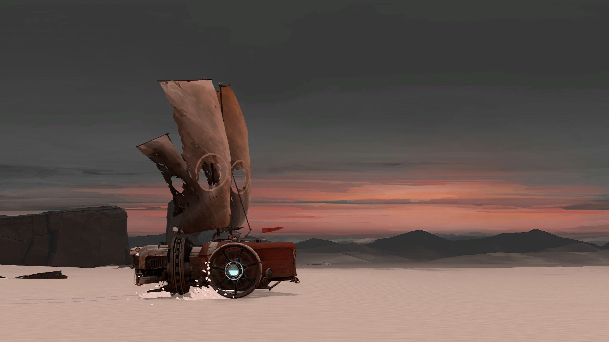

---
Meanwhile FAR: Changing Tides is Inside but with a boat: you are a small child in a big empty desaturated world and you have to operate a steam powered ship to the best of your ability to get to a vague destination somewhere on the right.
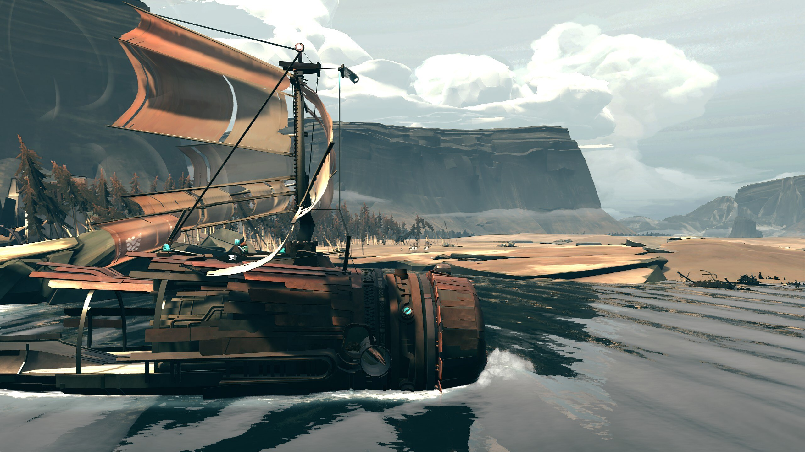

---
In both games you collect fuel for your vehicles and maintain them, stop to explore the structures along the way and gawp at the scenery passing by. Like their inspirations, there isn't much of a plot in either of the games (though the second ones have background lore), they are instead melancholy mood pieces involving searching for something in a big uncaring world. I recommend both of them if you are looking for something slower and atmospheric you can lose yourself in, and both games are very screenshotable.
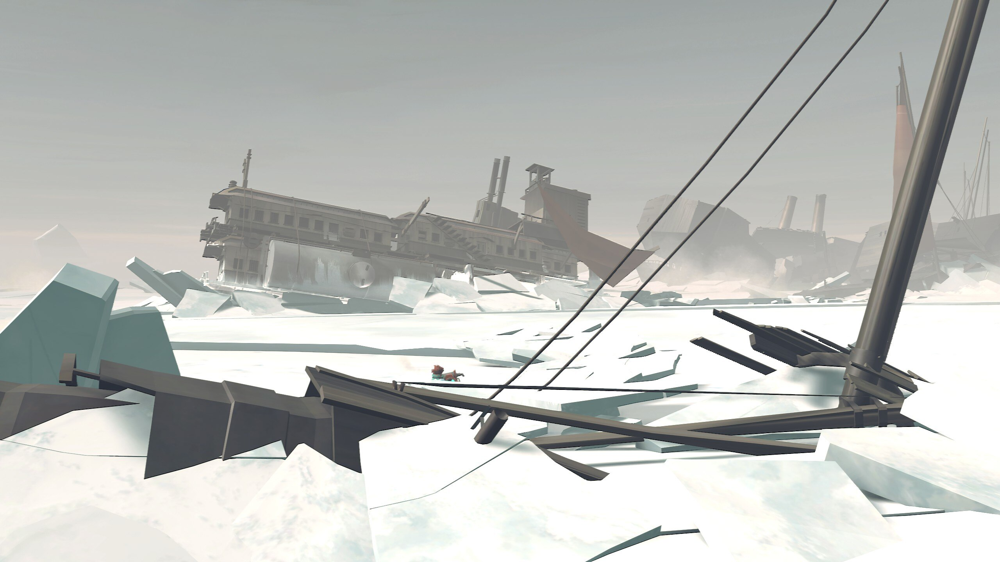
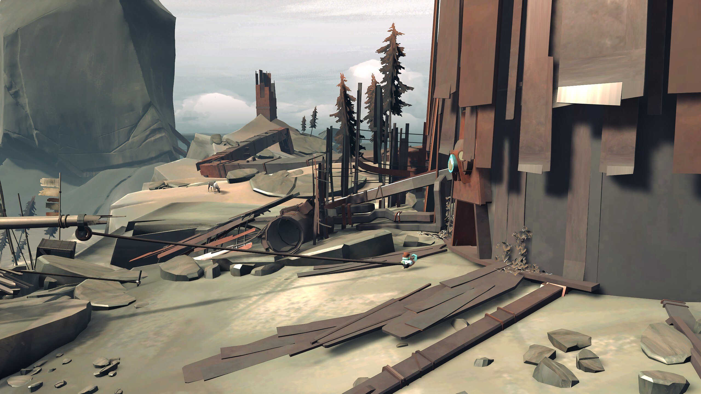
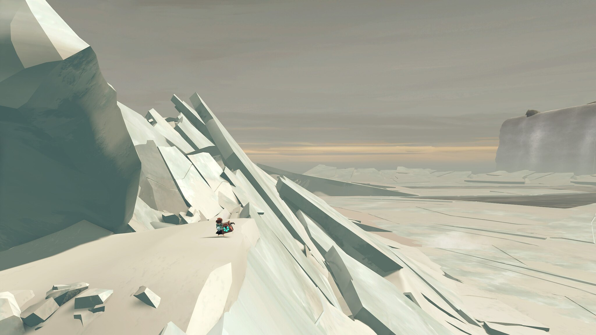

## Harmless Drudge {time: 2026-06-13T16:00:00.000Z}
I tried Harmless Drudge. It's a game that asks you to provide definitions for words in a dictionary, but it's actually about defining operations in a stack-based virtual machine in terms of other operations.

https://qwtyest.itch.io/harmless-drudge

---
Unlike other programming games, you are not building up complexity bottom-up, instead you are using the already existing full functionality of the programming language to define its operators. What it means in practice is circular definitions everywhere. If you are looking for a different take on a programming challenge, try this one. Just have some pen and paper ready, this gets involved fast.

## Salamander County Public Television {time: 2026-06-14T16:00:00.000Z}
Salamander County Public Television is a collection of odd minigames, strung together with a silly plot about producing content for the local TV station.

https://store.steampowered.com/app/1521810/Salamander_County_Public_Television/

---
Its art style consists entirely of stock images and videos, and the writing is fun and lighthearted. If you are looking for a pleasant way to erase ~2 hours, SCPTV (no relation to the SCP foundation) is worth getting on a discount.

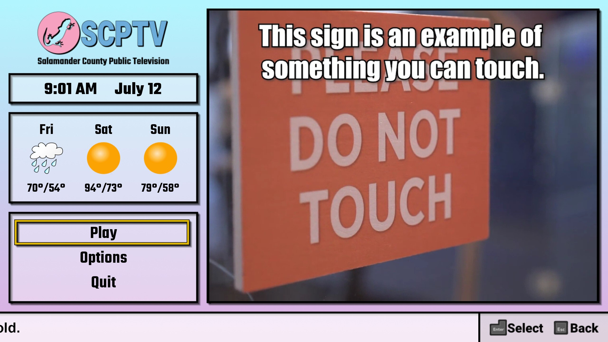
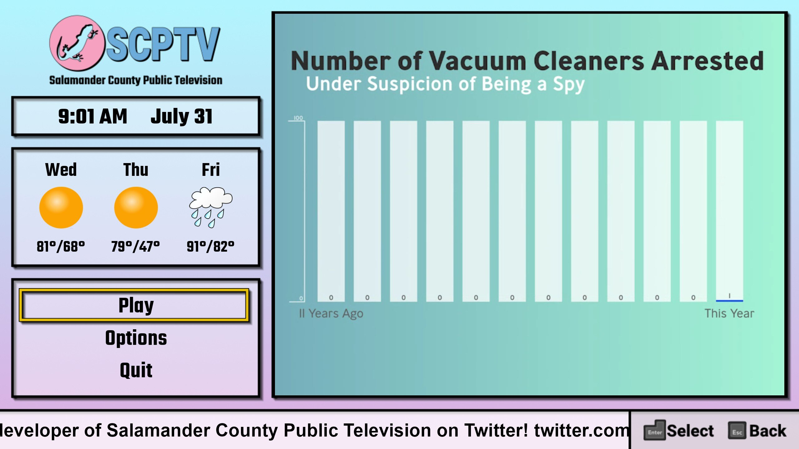
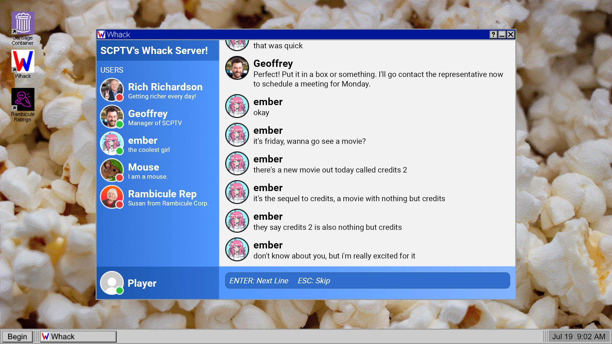
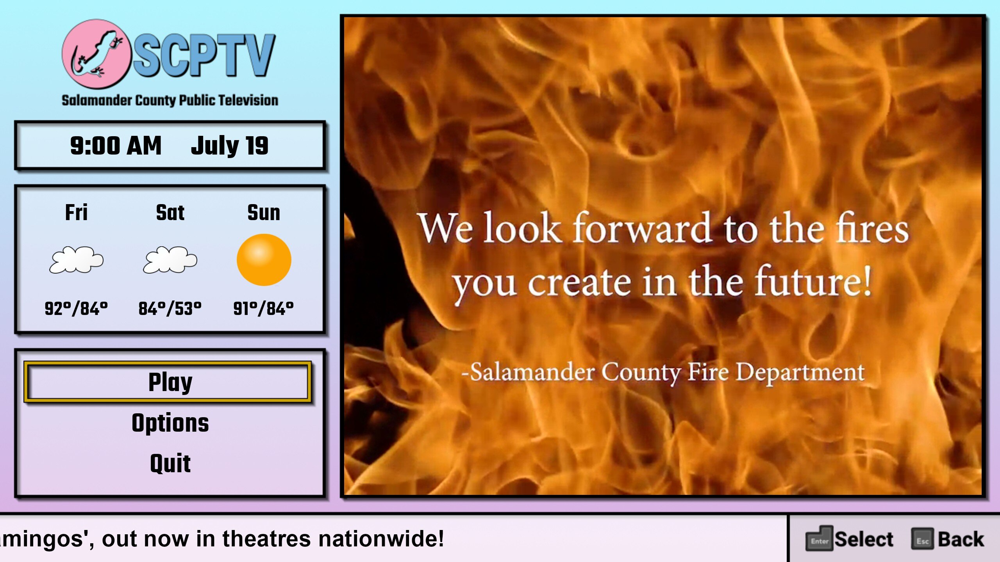

## Wavetale {time: 2026-06-15T16:00:00.000Z}
Wavetale is a 3d platformer with a strong focus on narrative, where you surf the waves trying to mitigate the effects of a recent ecological disaster.

https://store.steampowered.com/app/1823930/Wavetale/

---
The story is well-acted, it has a satisfying narrative arc, and it drives the game forward as there are few things to distract you from going to the next waypoint. I liked this, because methodically scouring levels for collectibles can sometimes feel like work. The controls are tight, the game provides a good sense of speed and scale, and overall it makes the protagonist feel good to control. The combat is underdeveloped, but the encounters are brief and easy enough that it never has enough time to grate. I enjoyed the 5 hours I spent getting through this game, would recommend this if you are looking for a quick narrative experience with some actual game mechanics.

## Yellow Taxi Goes Vroom {time: 2026-06-16T16:00:00.000Z}
Yellow Taxi Goes Vroom is a collectathon platformer, where you control a wind-up taxi that can spindash and flop on its roof.

https://store.steampowered.com/app/2011780/Yellow_Taxi_Goes_Vroom/

---
It's Crazy Taxi crossed with Super Mario Odyssey, a bright and cheerful game about constantly launching yourself off of sloped pieces of geometry in order to collect green gears, with the end goal of stopping Alien Mosk, the evil CEO of Tosla. It's an easy to learn, hard to master kind of game, as its controls really are just steering and spindash, with difficulty coming from accurately landing your jumps on increasingly precarious ledges.

I found the humor of the story to be hit and miss, though it's pretty funny that every single lawyer NPC drops the same legal disclaimer that any similarities to real things are strictly accidental. It took me ~12 hours to 100% it, though you can probably get through to the credits in about 8. I had fun, would recommend if you are looking for something vaguely Mario-shaped to unwind to.

---

## Tiny Terrys Turbo Trip {time: 2026-06-17T16:00:00.000Z}
In the same spirit as Yellow Taxi Goes Vroom, also consider Tiny Terry's Turbo Trip.

https://store.steampowered.com/app/2238040/Tiny_Terrys_Turbo_Trip/

## The Immortal John Triptych {time: 2026-06-18T16:00:00.000Z}
The Immortal John Triptych is a trilogy of point and click adventure games set inside renaissance paintings.
https://store.steampowered.com/curator/41213029-The-Immortal-John-Triptych/

---
Their plots and writing are Monty Python style absurdism that mixes the high cultural weight of its inspirations with low-brow humor (and disrespect of the christian Church in particular), and overall I found them to be pretty funny. For example, in the first game you are speedrunning the seven deadly sins for Church bureaucracy reasons. The puzzles are mostly reasonable, though I found the inventory a bit unwieldy. I found the third game to be weaker, but it also has the most cathartic ending. Each game also has a gallery that contains all of the paintings that were used to build it, so they are arguably educational. In short, I would recommend these to GAC as a whole, and you can finish each game in about 3 hours.

He also definitively jumped out of it, per the aforementioned ending of the final game.

## Curse Crackers: For Whom The Belle Toils {time: 2026-06-19T16:00:00.000Z}
Curse Crackers: For Whom the Belle Toils is a Game Boy Color inspired 2d platformer and yet another hidden gem that needs wider recognition.

https://store.steampowered.com/app/1726760/Curse_Crackers_For_Whom_the_Belle_Toils/

---
As far as basics go, the controls are satisfying and responsive, moving (especially fast) feels good and I always felt that any failures were my fault and not the game's. The game's unique mechanical feature is your bell-shaped companion that acts as an attack projectile and a bouncing platform, and he's fun to use. The difficulty starts off light and it steadily grows, becoming not too demanding by the end of the main story. The game keeps changing the level gimmicks and environments, so it never grows stale either. It has straightforward GB-era sensibilities, and I would recommend it as a straight platformer if you like the genre.

On top of this, the game distinguishes itself in two ways. First, the game is built around secrets. There are hidden collectibles in the levels, and extra hidden puzzles and quests if you really want to look for them. It's no Void Stranger, but it can satisfy the same itch, and I'm still working on the post-game content and mysteries. Second, this game has very girly sensibilities. The main story is about your rival stealing your boyfriend, all the quests and errands you do are about improving social bonds or trying to be helpful, other characters (majority of whom are women) have similar concerns, dating gets mentioned by them at all, and the post-game story seems to point towards the toxicity of being overly positive. It's not twee or cynically pink either, and it's worth flagging given how underserved the niche is.

Would recommend this game if you are looking for a good platformer, especially if you are a completionist looking for something satisfying to dig into. Howlongtobeat says that it's ~5 hours long if you mainline it, and I'm currently 17 hours in with an 87% save file. It's good.

## Terminal Lucidity {time: 2026-06-20T16:00:00.000Z}
Terminal Lucidity is a game about reverse engineering string ciphers.

https://store.steampowered.com/app/4154810/Terminal_Lucidity/

---
To progress, you have to send passwords to door locks. The locks are connected to computer terminals, each of which mangles the incoming text in some way before passing it on. The challenge is to figure out exactly what each computer does, so that you can make sure that the lock receives the correct plain text password. The computer terminals can be chained in a row, and later you learn how to change how the machines are connected in order to unlock more demanding locks. Everything in the game is gated by knowledge, you don't unlock any abilities that let you do things you couldn't at the start.

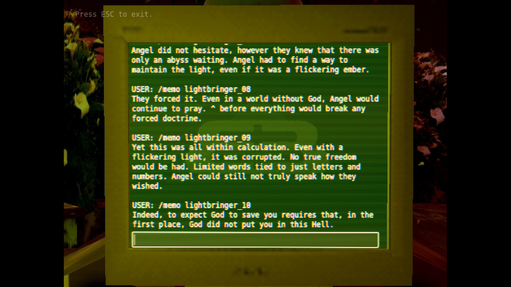

However, this is only half of the game. The other half is looking for clues in a 3d environment, interrogating the terminals themselves and trying to figure out the sometimes cryptic hints the locks provide. I had to look up the guide because I missed some post-it notes in the concrete basement you find yourself in, but I had fun figuring out the black boxes that each terminal presents. There is also a greater mystery, but I missed even more post-its and I wasn't in the mood to reopen everything again.

I would recommend this game to anyone engineering-minded, just be aware that writing down notes and solutions is mandatory as the game doesn't save in-game progress. Also, the game is free, and it took me ~6 hours to get to the first ending.

## Lunistice {time: 2026-06-21T16:00:00.000Z}
Lunistice is a 3d platformer inspired by games from the PS1/Dreamcast era.

https://store.steampowered.com/app/1701800/Lunistice/

---
It's a chill, straightforward game with not much movement complexity, with levels that are mostly about following a line through objects floating in space. It has a cheerful art style and music, is not too difficult, and can be finished in about 3 hours (though it took me 12 hours to do everything). It's similar to Toree games in terms of its design goals, if anyone here played those.

Would recommend if you like platformers and you're looking for something short to unwind to.

## Solas 128 {time: 2026-06-22T16:00:00.000Z}
Solas 128 is a puzzle game about redirecting lasers.

https://store.steampowered.com/app/1257850/SOLAS_128/

---
It does two things that set it apart from similar kinds of games: first, you are directing the movements of individual photons, which introduces timing into the solution space. 

Secondly, the game presents a large interconnected puzzle, and later on solutions involve thinking about multiple puzzle rooms at the same time.

It's a good brain teaser, would recommend if you're looking for something like it right now.

## Be Not Afraid {time: 2026-06-23T16:00:00.000Z}

Be Not Afraid A.K.A. Seraphim Horror Show!? is a collection of minigames, framed as you (a human) participating in a game show for "biblically accurate" angels.

https://slitherpunk.itch.io/be-not-afraid

---
You have to collect extra time to maintain your sanity against the angels' incomprehensible natures and try to escape. It has an interesting collage-in-3d-space art style with some unique visual designs. Would recommend if you're looking for something different for an hour.

## Horse Magnifier {time: 2026-06-24T16:00:00.000Z}

Horse Magnifier is a short game about putting lenses on pictures of horses. I recommend it if you want to spend fifteen minutes giggling while distorting horses.

https://wer8888.itch.io/horse-magnifier

## Trepang2 {time: 2026-06-25T16:00:00.000Z}
Trepang2 is an FPS about an illuminati super soldier clone who dismantles Amazon one anomalous object at a time.

https://store.steampowered.com/app/1164940/Trepang2/

---
It's a straightforward shooter directly inspired by F.E.A.R. (i.e. it has lots of slow motion Matrixy combat in corporate and industrial environments against spec ops bad guys with some supernatural horror elements), but with modern additions (schmovement, invisibility cloak, some ideas from Call of Duties, SCP-inspired horror instead of The Ring).

This game's main combat loop is fun while the novelty lasts, but I found that it gets a bit one note. But since Trepang2 was made by a team of 4 and with surprisingly high production values, that's understandable. You'll have fun painting walls with raspberry jam, finish the game in about ~6 hours for all the campaign and side missions, and then put it away satisfied.

If you're looking for an FPS built around a short single player campaign, this one is worth experiencing.

## Hieronymus {time: 2026-06-26T16:00:00.000Z}
Someone turned the Garden of Earthly Delights into an FPS: https://store.steampowered.com/app/2518790/Hieronymus/

## Northern Journey {time: 2026-06-27T16:00:00.000Z}
Northern Journey is a game about hiking in mythological Scandinavia, as you carry out an ordeal for the crime of passing by the wrong fjord in a row boat. 

https://store.steampowered.com/app/1639790/Northern_Journey/

---
Mechanically, this is an FPS with early 2000s-level graphics and metroidvania-like level progression. In practice, this is one of the most atmospheric games I've played recently. 
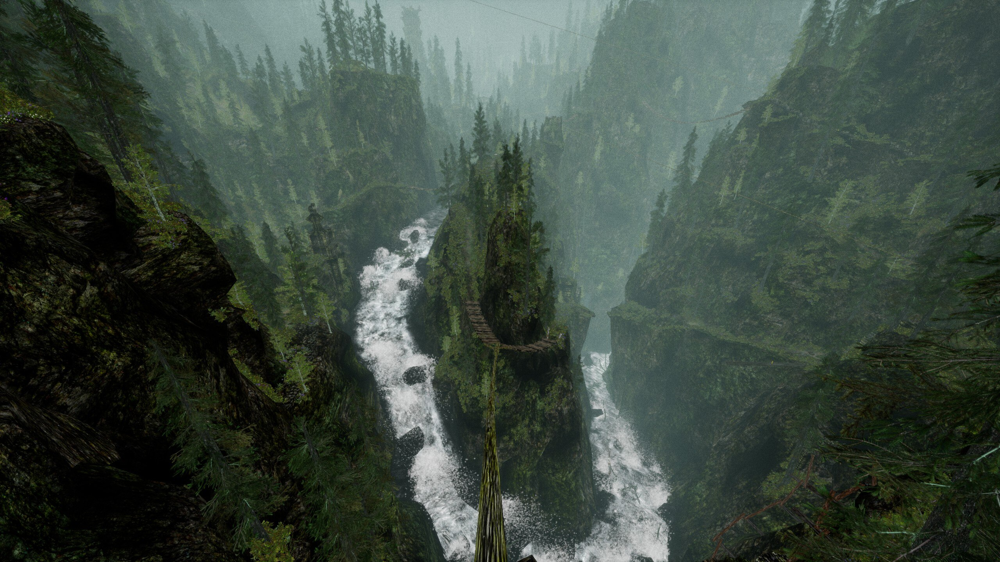

The environments immediately evoke a walk through a damp forest after it just rained, and every single area in the game is photogenic and incredibly screenshottable. Furthermore, the game runs on the old folklore logic: the nature is uncaring and every level feels carved into a landscape rather than being designed for optimal gameplay experience, and the story resembles a dark tale from an isolated community where you have to deal with malicious spirits, objects of superstition and inexplicable magic. It hits the pre-modern mindset and there's a lot to be immersed in, you can clearly tell that the author likes hiking.
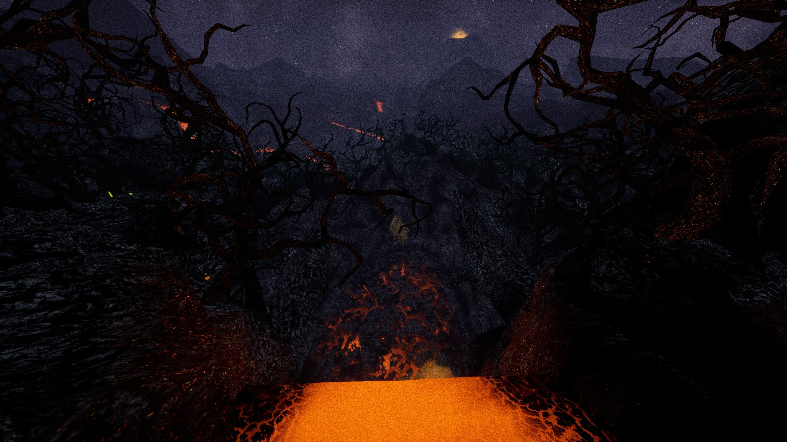
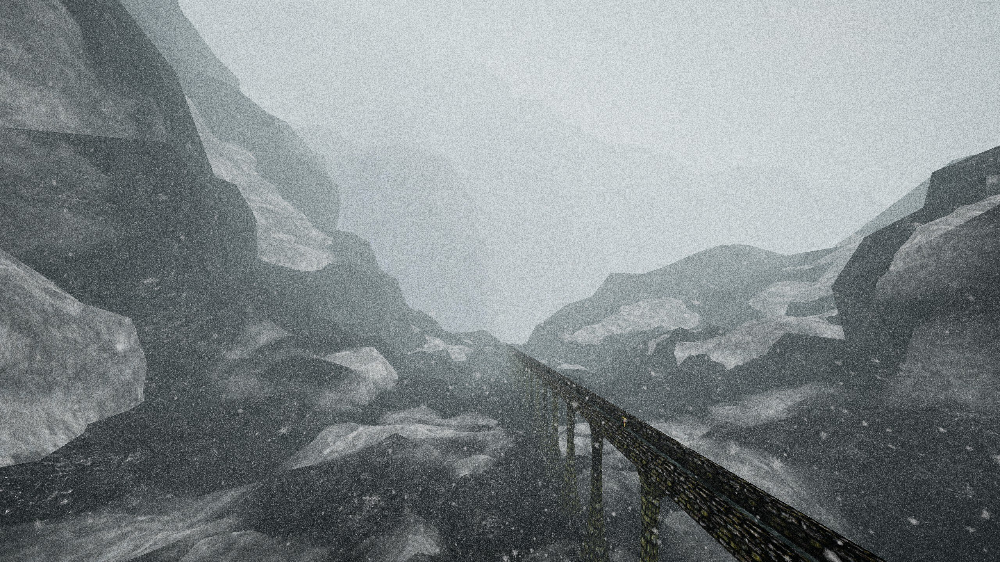

There is also combat. For the most part it's there to provide friction to make exploration more interesting, but unfortunately it also has some boss fights that tend to degenerate into S+M1 in confined spaces. This can get frustrating, so make sure to adjust the difficulty slider in the options menu if it's a problem. You should also avoid this game if you hate insects and especially spiders, since man-sized crawlies are most of your opposition.
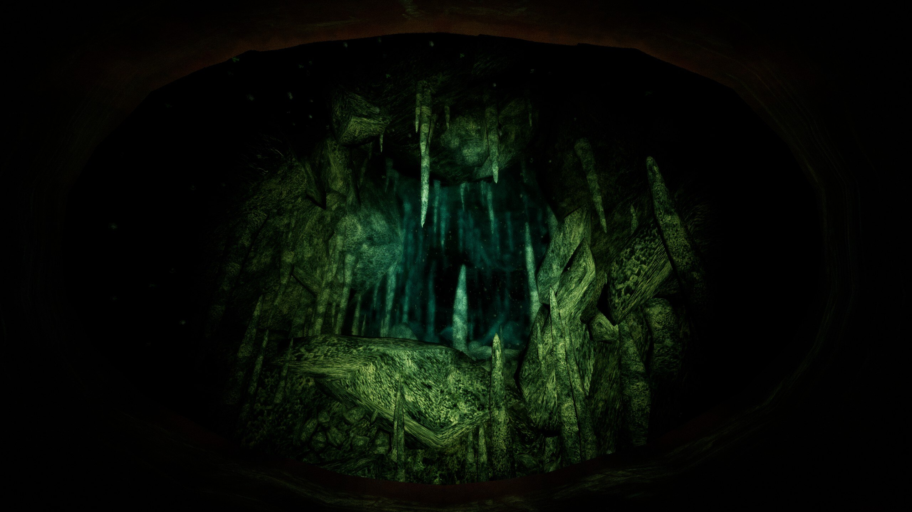

Overall, I liked this game a lot and I would recommend it to anyone who would like to be immersed in untamed wilderness for a while. It took me about 12 hours to finish it.
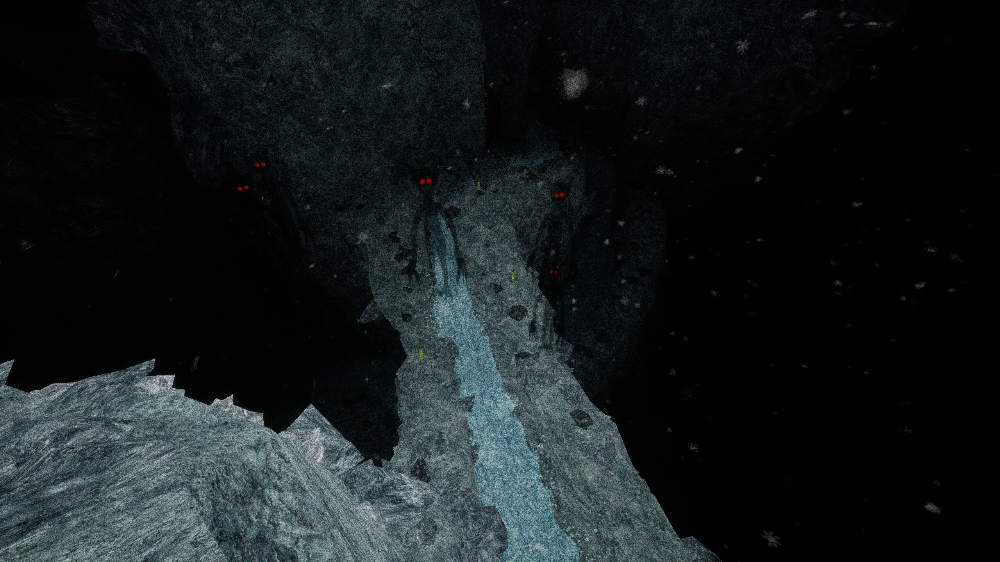
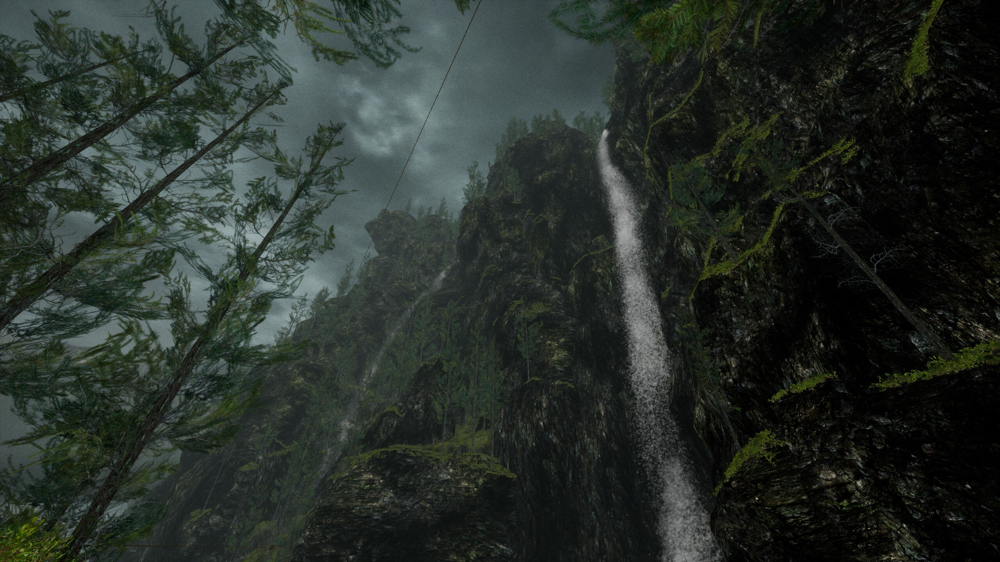
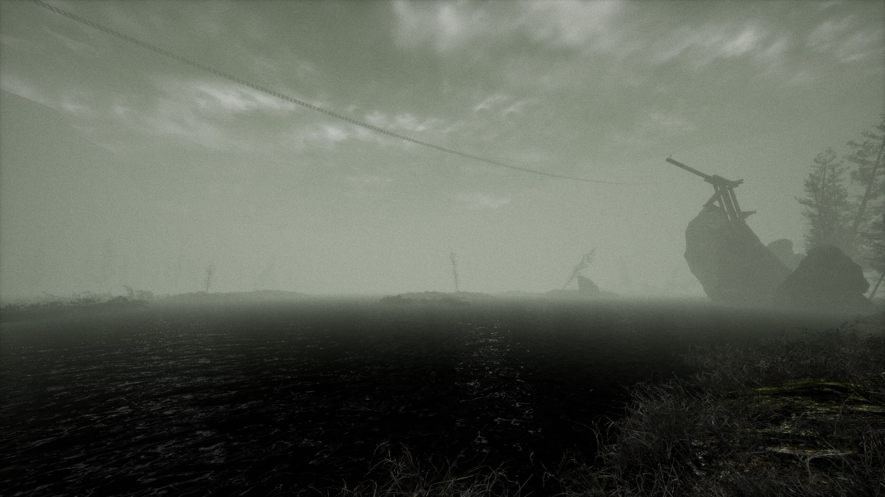
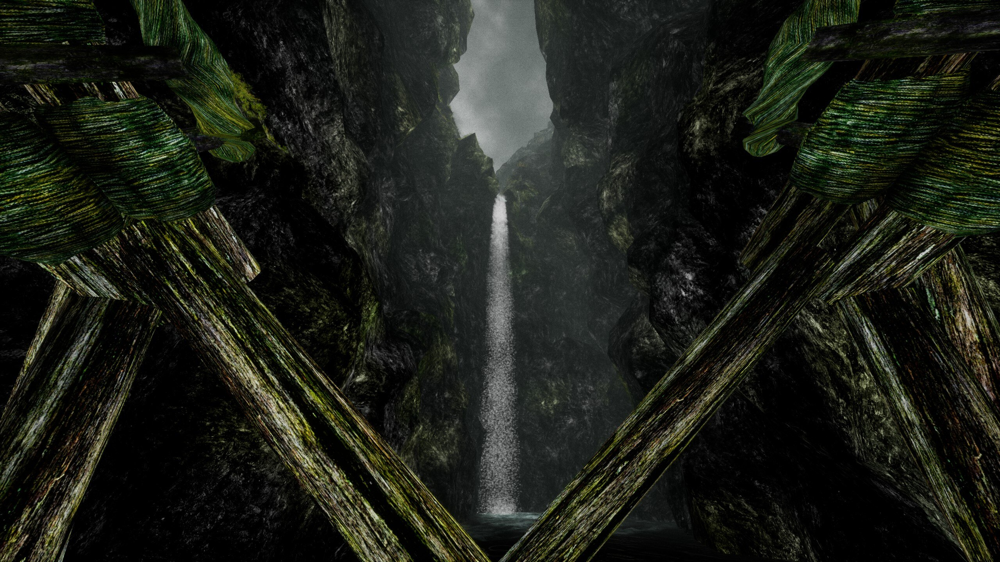

---
Also, there's every kind of spider in the game.

## Orbo's Odyssey {time: 2026-06-28T19:00:00.000Z}
Orbo's Odyssey is a short 3d platformer about a little scrunkly man who accidentally locked himself inside his boss' office.

https://store.steampowered.com/app/2539960/Orbos_Odyssey/

--- 
He is now on a quest to collect some gears to 3d print himself an arm he can then use to rotate the office door knob and leave. In gameplay Orbo can fire himself forward like a bullet and do some bunny hopping to maintain speed. The moveset and platforming don't really have anywhere to evolve since the bullet boost is that overpowered, but the game is short enough that it doesn't become a problem. I found the game's areas and writing fun to explore, with endearing text and some sticky details inside the levels (e.g. sniper rifle equipped Draculas keeping you inside the mission area). The music consists entirely of 2000s Drum and Bass.
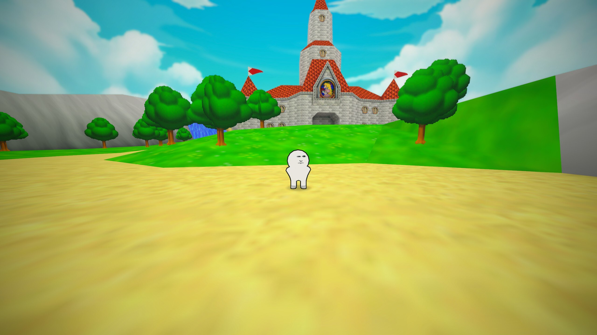

You can rinse this game in about 1 hour, would recommend it if you want to dip into something with great feeling movement for a bit.

## Later Alligator {time: 2026-06-29T16:00:00.000Z}
In Later Alligator you help an anxiety-ridden alligator Pat calm his nerves by investigating his family, who will throw him a birthday party/murder him for betraying the mafia this evening. 

https://store.steampowered.com/app/966320/Later_Alligator/

---
Mechanically it's a collection of minigames, connected with a point and click adventure.

The minigames themselves are a mixed bag, they're sometimes funny, mostly mediocre, and there's amazingly terrible pinball that demonstrates everything I dislike about pinball. However, they are also used to develop the characters they are attached to. You get to meet Pat's entire extended family in the Alligator New-York and help them with their individual woes, and they are written and animated in an endearing and often funny manner.

The writing carries this game, and it helps the few frustrations I had with it to fade into the background (unless you want to get all the achievements). I also found the game's music loops a bit grating, but that's neither here nor there.

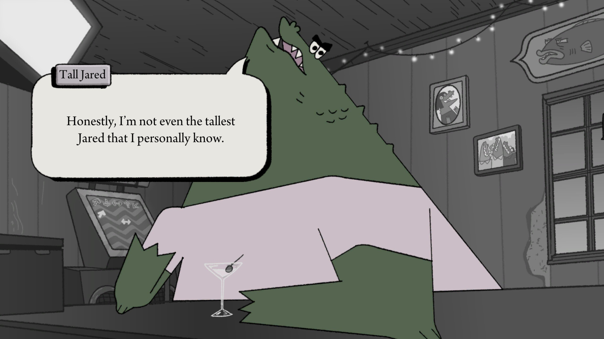

I finished the game, got all the collectibles and the true ending in about 4.5 hours. I would recommend this if you're looking for something warm, relaxed and family-friendly.

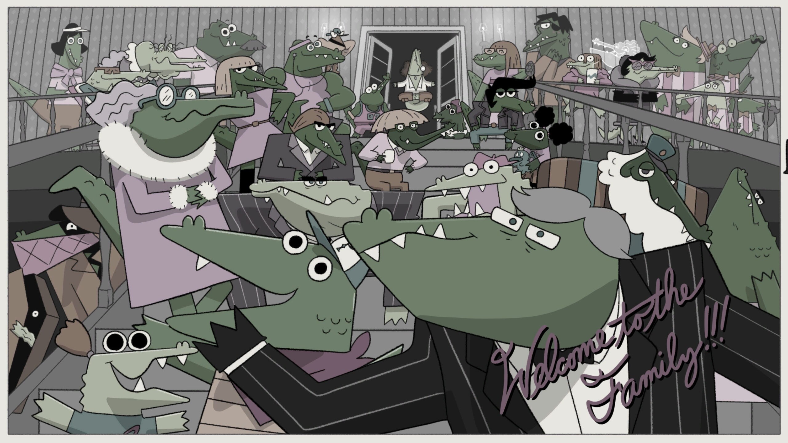

## Tactical Breach Wizards {time: 2026-06-30T16:00:00.000Z}
Do you know the door breach sequences in Call of Duty? Where you place a breaching charge on a door, it explodes, and then you shoot every bad guy in a room while the time is slowed down?

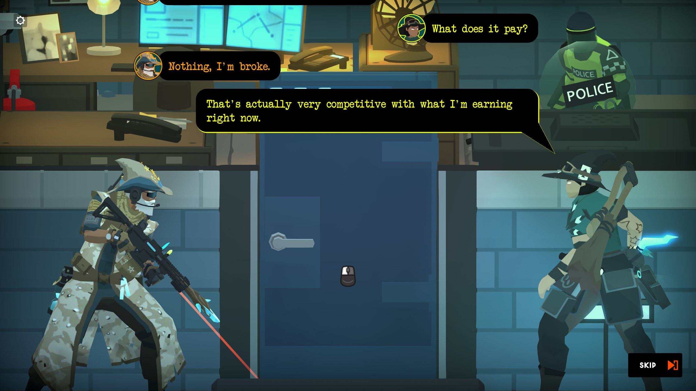

---

Tactical Breach Wizards is that sequence turned into a full tactics puzzle, but with militarized wizards instead of elite soldiers.

https://store.steampowered.com/app/1043810/Tactical_Breach_Wizards/

---
Mechanically, this is Into the Breach if it was a puzzle game. Each of your units can do one movement and one action per turn, and you can see what every enemy unit is going to do at the end of the current turn. Unlike the other titles in the genre, you also have unlimited undo up to the beginning of the turn that lets you experiment. The abilities of each of your wizards are likewise designed to interact in interesting ways, and so the game wants you to solve each position and orchestrate crazy plays to get perfect turns, instead of forcing you to commit to your actions. This is fun.

---
The plot also has lots to like. It plays out like a typical geopolitical thriller, but in which humanity has successfully militarized magic and now it's just another kind of technology used by people and governments for good and ill. It's well thought out, and I wouldn't mind another game in this setting. I found the prose to be funny and well-made, with good Deadpool-style banter that is delivered by actually likable middle-aged messes of characters, instead of some obnoxious main character types.

---
It took me about 30 hours (so, shorter than the length of an XCOM campaign) to 100% the game on the harder difficulty preset. Tactical Breach Wizards is friendly with its difficulty: you can freely tune how forgiving the game is, and you can skip any cutscene or level that you may find frustrating without the game judging you. I would recommend this to people who would like to get into tactics games, genre veterans who like the tactical puzzle itself, and people who wished Into the Breach wasn't a roguelike in particular.

## I Am Your Beast {time: 2026-07-01T16:00:00.000Z}
I Am Your Beast is about a local John Wick type who resigns his job in the US Military. John's commanding officer doesn't take this decision well, so John must spend the entire game fertilizing the forest with the soldiers sent after him.

https://store.steampowered.com/app/1876590/I_Am_Your_Beast/

---
This is an FPS about speedrunning through small (~60 second) levels to get the lowest completion time, similar to something like Neon White. Killing enemies reduces the time on the clock, so it's not just about beelining towards the level's objectives. The story campaign consists of more open areas that you'll have to plot an optimal path through, and the challenge levels tend more towards prescriptive linear gauntlets. You'll get the most out of this game if you enjoy chasing ranks in challenge modes with all the repetition it implies, as without it this is just a short shooter with a standout soundtrack.

## Prodigal {time: 2026-07-02T16:00:00.000Z}
Prodigal is a 2d Zelda-like about a thief returning to his community and making amends.

https://store.steampowered.com/app/1393820/Prodigal/

---
Prodigal is heavily inspired by the Gameboy Legend of Zelda games: you explore dungeons to find items, defeat bosses that are defeated with the said item, and then you go find another dungeon while helping the townsfolk in between.

---
The first half of the game is a pretty formulaic Zelda adventure (that I found on the easier side) where the protagonist goes through his narrative arc and saves the day. You can end the game right there with a satisfying ending, but what's unusual is that there's another half of the game after the credits. This is a separate story arc that is centered more on the affairs of the settlement, how you become a part of its community, and a dive into the world's lore. There are more areas to explore and items to find, it's not just more side quests. I think I only ever saw Nier structure itself like this. And there are more things to find after that's done too, if you like digging for secrets.

---
Overall I found it enjoyable, and it took me about 7 hours for each of the two main endings. It could be more polished, but this was the team's first published project and it's a good effort. Would recommend it if a more forgiving Mina the Hollower sounds fun to you.

## End of daily posts {time: 2026-07-03T16:00:00.000Z}
Daily posts will now end. The full archive up to this point is now available at http://t0mg.github.io/copyofnewfolder1.

More reviews may still be posted here albeit at a slower pace.
Thank you for reading.
